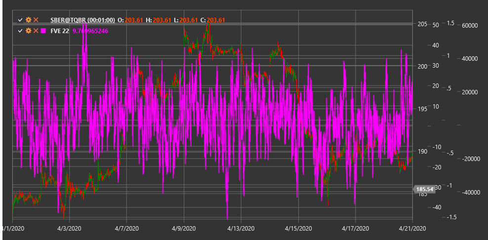

# FVE

**Элемент конечного объема (Finite Volume Element, FVE)** - это технический индикатор, разработанный для анализа взаимосвязи между ценой и объемом, который помогает оценивать давление покупателей и продавцов на рынке.

Для использования индикатора необходимо использовать класс [FiniteVolumeElement](xref:StockSharp.Algo.Indicators.FiniteVolumeElement).

## Описание

Элемент конечного объема (FVE) анализирует соотношение между ценовыми изменениями и объемами торгов, чтобы определить потенциальную силу движения цены. Он основан на предположении, что ценовые изменения наиболее значимы, когда они подтверждаются соответствующими объемами.

Индикатор FVE преобразует изменение цены, взвешенное по объему, в осциллятор, который помогает определить относительный баланс между покупателями и продавцами на рынке. Положительные значения FVE указывают на преобладание покупателей, а отрицательные - на преобладание продавцов.

FVE особенно полезен для:
- Оценки силы и устойчивости текущего тренда
- Выявления потенциальных точек разворота
- Определения дивергенций между ценой и объемом
- Подтверждения сигналов других индикаторов

## Параметры

Индикатор имеет следующие параметры:
- **Length** - период сглаживания (стандартное значение: 22)

## Расчет

Расчет индикатора FVE включает несколько этапов:

1. Расчет типичной цены для текущего и предыдущего периодов:
   ```
   Typical Price = (High + Low + Close) / 3
   ```

2. Расчет изменения типичной цены:
   ```
   Price Change = Typical Price[текущий] - Typical Price[предыдущий]
   ```

3. Расчет взвешенного по объему изменения цены:
   ```
   Volume-Weighted Price Change = Price Change * Volume[текущий]
   ```

4. Нормализация для учета масштаба рынка:
   ```
   Normalized Value = Volume-Weighted Price Change / (Средний объем за период * Волатильность цены)
   ```

5. Кумулятивное суммирование и сглаживание:
   ```
   FVE = SMA(Cumulative Sum of Normalized Values, Length)
   ```

где:
- High, Low, Close - максимальная, минимальная и закрывающая цены
- Volume - объем торгов
- SMA - простое скользящее среднее
- Length - период сглаживания

## Интерпретация

Индикатор FVE можно интерпретировать следующим образом:

1. **Пересечение нулевой линии**:
   - Переход от отрицательных значений к положительным указывает на усиление давления покупателей и может рассматриваться как бычий сигнал
   - Переход от положительных значений к отрицательным указывает на усиление давления продавцов и может рассматриваться как медвежий сигнал

2. **Экстремальные значения**:
   - Высокие положительные значения (выше +3) могут указывать на перекупленность рынка
   - Высокие отрицательные значения (ниже -3) могут указывать на перепроданность рынка

3. **Дивергенции**:
   - Бычья дивергенция (цена формирует новый минимум, а FVE - более высокий минимум) может сигнализировать о потенциальном развороте вверх
   - Медвежья дивергенция (цена формирует новый максимум, а FVE - более низкий максимум) может сигнализировать о потенциальном развороте вниз

4. **Подтверждение тренда**:
   - Устойчиво положительные значения FVE подтверждают силу восходящего тренда
   - Устойчиво отрицательные значения FVE подтверждают силу нисходящего тренда

5. **Скорость изменения FVE**:
   - Быстрый рост или падение значений FVE может указывать на сильный импульс движения цены
   - Замедление изменения значений FVE может сигнализировать о потенциальном замедлении импульса

6. **Уровни поддержки и сопротивления**:
   - Исторические точки разворота на графике FVE могут служить ориентирами для будущих разворотов



## См. также

[OBV](obv.md)
[ADL](accumulation_distribution_line.md)
[ForceIndex](force_index.md)
[ChaikinMoneyFlow](chaikin_money_flow.md)