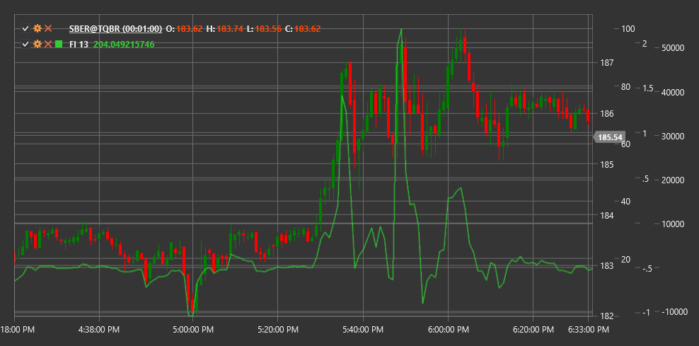

# FI

**Индекс силы (Force Index, FI)** - это технический индикатор, разработанный доктором Александром Элдером, который измеряет силу каждого движения цены на основе ее направления, величины и объема торгов.

Для использования индикатора необходимо использовать класс [ForceIndex](xref:StockSharp.Algo.Indicators.ForceIndex).

## Описание

Индекс силы (Force Index) представляет собой осциллятор, который измеряет силу "быков" (покупателей) или "медведей" (продавцов) на каждом движении цены. Он объединяет три важных элемента рыночной информации: направление движения цены, величину движения и объем торгов.

Основная идея индикатора заключается в том, что чем больше изменение цены и чем больше объем торгов, тем сильнее движение рынка. Положительные значения индекса силы указывают на преобладание покупателей (бычье давление), а отрицательные значения указывают на преобладание продавцов (медвежье давление).

Индекс силы особенно полезен для:
- Определения силы текущего тренда
- Выявления потенциальных точек разворота
- Подтверждения прорывов и пробоев
- Обнаружения дивергенций между ценой и силой движения

## Параметры

Индикатор имеет следующие параметры:
- **Length** - период сглаживания (стандартное значение: 13)

## Расчет

Расчет Индекса силы включает следующие этапы:

1. Вычисление однодневного (или одного периода) Индекса силы:
   ```
   1-Period Force Index = (Close[текущий] - Close[предыдущий]) * Volume[текущий]
   ```

2. Сглаживание с использованием экспоненциального скользящего среднего (EMA):
   ```
   Force Index = EMA(1-Period Force Index, Length)
   ```

где:
- Close - цена закрытия
- Volume - объем торгов
- EMA - экспоненциальное скользящее среднее
- Length - период сглаживания

## Интерпретация

Индекс силы может интерпретироваться различными способами:

1. **Пересечение нулевой линии**:
   - Переход от отрицательных значений к положительным указывает на усиление бычьего давления и может рассматриваться как сигнал к покупке
   - Переход от положительных значений к отрицательным указывает на усиление медвежьего давления и может рассматриваться как сигнал к продаже

2. **Экстремальные значения**:
   - Высокие положительные значения указывают на сильное бычье давление, которое может привести к перекупленности рынка
   - Высокие отрицательные значения указывают на сильное медвежье давление, которое может привести к перепроданности рынка

3. **Дивергенции**:
   - Бычья дивергенция (цена формирует новый минимум, а Индекс силы - более высокий минимум) может сигнализировать о потенциальном развороте вверх
   - Медвежья дивергенция (цена формирует новый максимум, а Индекс силы - более низкий максимум) может сигнализировать о потенциальном развороте вниз

4. **Подтверждение тренда**:
   - Устойчиво положительные значения Индекса силы подтверждают силу восходящего тренда
   - Устойчиво отрицательные значения Индекса силы подтверждают силу нисходящего тренда

5. **Тройное использование** (по Элдеру):
   - Краткосрочный индекс силы (2-дневный): для определения краткосрочных возможностей
   - Среднесрочный индекс силы (13-дневный): для определения среднесрочных трендов и коррекций
   - Долгосрочный индекс силы (100-дневный): для определения основного тренда

6. **Определение коррекций**:
   - В восходящем тренде дни с отрицательным Индексом силы могут указывать на временные коррекции
   - В нисходящем тренде дни с положительным Индексом силы могут указывать на временные отскоки



## См. также

[EMA](ema.md)
[OBV](obv.md)
[ADL](accumulation_distribution_line.md)
[ElderRays](elder_rays.md)