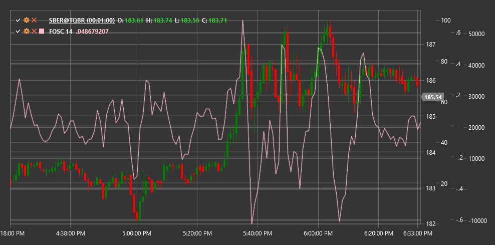

# FOSC

**Осциллятор прогноза (Forecast Oscillator, FOSC)** - это технический индикатор, который измеряет отклонение цены от ее прогнозируемого значения, полученного с помощью линейной регрессии, и представляет это отклонение в виде процентного соотношения.

Для использования индикатора необходимо использовать класс [ForecastOscillator](xref:StockSharp.Algo.Indicators.ForecastOscillator).

## Описание

Осциллятор прогноза (FOSC) основан на линейной регрессии и предназначен для измерения степени отклонения текущей цены от ее прогнозируемого значения. Он помогает трейдерам оценить, насколько текущая цена соответствует ожидаемому тренду или отклоняется от него.

Индикатор рассчитывает линию тренда с использованием линейной регрессии за указанный период, а затем сравнивает фактическую цену закрытия с прогнозным значением на этой линии. Разница выражается в процентах, что делает FOSC осциллятором, колеблющимся вокруг нулевой линии.

Осциллятор прогноза особенно полезен для:
- Определения степени соответствия цены ожидаемому тренду
- Выявления потенциальных точек разворота
- Обнаружения экстремальных отклонений цены от тренда
- Идентификации периодов, когда цена движется быстрее или медленнее, чем ожидалось

## Параметры

Индикатор имеет следующие параметры:
- **Length** - период для расчета линейной регрессии (стандартное значение: 14)

## Расчет

Расчет Осциллятора прогноза включает следующие этапы:

1. Расчет прогнозной линии с использованием линейной регрессии за указанный период:
   ```
   Forecast = Linear Regression Line(Close, Length)
   ```

2. Расчет осциллятора как процентного отношения между текущей ценой и прогнозным значением:
   ```
   FOSC = ((Close - Forecast) / Forecast) * 100
   ```

где:
- Close - текущая цена закрытия
- Forecast - прогнозное значение, полученное с помощью линейной регрессии
- Length - период для расчета линейной регрессии

## Интерпретация

Осциллятор прогноза интерпретируется следующим образом:

1. **Отклонение от нуля**:
   - Положительные значения (FOSC > 0) указывают на то, что текущая цена выше прогнозируемого значения, что может свидетельствовать о более сильном восходящем движении, чем ожидалось
   - Отрицательные значения (FOSC < 0) указывают на то, что текущая цена ниже прогнозируемого значения, что может свидетельствовать о более сильном нисходящем движении, чем ожидалось

2. **Экстремальные значения**:
   - Очень высокие положительные значения могут указывать на перекупленность рынка относительно тренда
   - Очень низкие отрицательные значения могут указывать на перепроданность рынка относительно тренда

3. **Возврат к нулю**:
   - Движение FOSC от экстремальных значений к нулю может сигнализировать о потенциальном возврате цены к ее трендовой линии

4. **Пересечение нулевой линии**:
   - Пересечение нулевой линии снизу вверх может рассматриваться как бычий сигнал
   - Пересечение нулевой линии сверху вниз может рассматриваться как медвежий сигнал

5. **Дивергенции**:
   - Бычья дивергенция (цена формирует новый минимум, а FOSC - более высокий минимум) может указывать на потенциальный разворот вверх
   - Медвежья дивергенция (цена формирует новый максимум, а FOSC - более низкий максимум) может указывать на потенциальный разворот вниз

6. **Подтверждение тренда**:
   - Если FOSC движется в том же направлении, что и цена, это подтверждает силу текущего тренда
   - Если FOSC движется в направлении, противоположном цене, это может указывать на ослабление текущего тренда



## См. также

[LinearRegression](lrc.md)
[StandardError](standard_error.md)
[DisparityIndex](disparity_index.md)