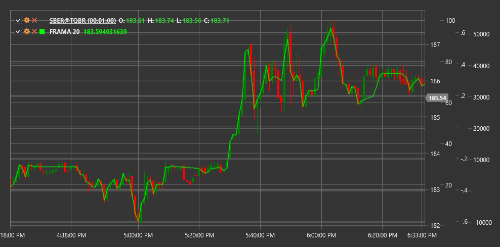

# FRAMA

**Фрактальная адаптивная скользящая средняя (Fractal Adaptive Moving Average, FRAMA)** - это технический индикатор, разработанный Джоном Элерсом, который адаптирует скорость реакции на изменения цены в зависимости от фрактальной размерности рынка.

Для использования индикатора необходимо использовать класс [FractalAdaptiveMovingAverage](xref:StockSharp.Algo.Indicators.FractalAdaptiveMovingAverage).

## Описание

Фрактальная адаптивная скользящая средняя (FRAMA) - это усовершенствованный вид экспоненциальной скользящей средней (EMA), которая автоматически регулирует свою чувствительность к изменениям цены на основе фрактальной размерности рынка. Индикатор был разработан Джоном Элерсом и представлен в журнале Technical Analysis of Stocks & Commodities в октябре 2000 года.

FRAMA использует концепцию фрактальной геометрии для анализа структуры рынка. Она определяет, насколько "фрактален" или хаотичен текущий рынок, и на основе этого регулирует скорость реакции индикатора:

- В трендовых (менее фрактальных) рыночных условиях FRAMA быстро реагирует на изменения цены, подобно короткой EMA
- В боковых (более фрактальных) рыночных условиях FRAMA реагирует медленнее, подобно длинной EMA

Это позволяет FRAMA быстрее реагировать на значимые ценовые движения и игнорировать рыночный шум, что делает ее более эффективной по сравнению с традиционными скользящими средними.

## Параметры

Индикатор имеет следующие параметры:
- **Length** - период расчета (стандартное значение: 10-20)

## Расчет

Расчет FRAMA включает несколько этапов:

1. Расчет фрактальной размерности (D) на основе логарифмического отношения длины высокой-низкой цены к количеству периодов:
   ```
   N1 = Высокая(1...Length/2) - Низкая(1...Length/2)
   N2 = Высокая(Length/2+1...Length) - Низкая(Length/2+1...Length)
   N3 = Высокая(1...Length) - Низкая(1...Length)
   
   D = (log(N1 + N2) - log(N3)) / log(2)
   ```

2. Преобразование фрактальной размерности в альфа-фактор для экспоненциального сглаживания:
   ```
   Фактор сглаживания = exp(-4.6 * (D - 1))
   Альфа = Фактор сглаживания * Фактор сглаживания
   ```

3. Применение альфа-фактора к текущей цене и предыдущему значению FRAMA:
   ```
   FRAMA = Альфа * Цена + (1 - Альфа) * FRAMA[предыдущий]
   ```

где:
- Высокая - максимальная цена за период
- Низкая - минимальная цена за период
- log - натуральный логарифм

## Интерпретация

FRAMA может интерпретироваться аналогично другим скользящим средним, но с учетом ее адаптивной природы:

1. **Направление FRAMA**:
   - Восходящая FRAMA указывает на восходящий тренд
   - Нисходящая FRAMA указывает на нисходящий тренд

2. **Пересечение с ценой**:
   - Когда цена пересекает FRAMA снизу вверх, это может рассматриваться как бычий сигнал
   - Когда цена пересекает FRAMA сверху вниз, это может рассматриваться как медвежий сигнал

3. **Пересечения нескольких FRAMA**:
   - Пересечение короткой FRAMA с длинной FRAMA снизу вверх может указывать на начало восходящего тренда
   - Пересечение короткой FRAMA с длинной FRAMA сверху вниз может указывать на начало нисходящего тренда

4. **Угол наклона FRAMA**:
   - Крутой угол наклона указывает на сильный тренд
   - Пологий угол наклона указывает на слабый тренд
   - Горизонтальное движение указывает на боковой тренд

5. **Фильтрация сигналов**:
   - Благодаря своей адаптивной природе, FRAMA создает меньше ложных сигналов, чем традиционные скользящие средние
   - Чем меньше период FRAMA, тем более чувствительным будет индикатор к изменениям цены

6. **Уровни поддержки и сопротивления**:
   - FRAMA может служить динамическим уровнем поддержки в восходящем тренде
   - FRAMA может служить динамическим уровнем сопротивления в нисходящем тренде



## См. также

[EMA](ema.md)
[KAMA](kama.md)
[VIDYA](vidya.md)
[AMA](adaptive_moving_average.md)