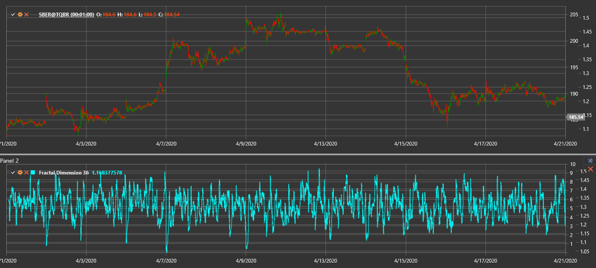

# FDI

**Индекс фрактальной размерности (Fractal Dimension Index, FDI)** – показатель хаотичности ценового движения.

Для использования индикатора необходимо использовать класс [FractalDimension](xref:StockSharp.Algo.Indicators.FractalDimension).

## Описание

FDI принимает значения от 1 до 2 и отражает характер рынка:
- Значения около 1 указывают на направленный тренд (гладкий путь цены).
- Значения около 1.5 соответствуют случайному блужданию.
- Значения ближе к 2 говорят о боковом или "шумном" рынке.

Индикатор базируется на фрактальной геометрии и измеряет, насколько сложен пройденный ценой путь.

## Параметры

Индикатор имеет следующий параметр:
- **Length** – период расчёта (стандартное значение: 30)

## Расчёт

Индекс вычисляется сравнением длины ценового пути с общим диапазоном:

1. Суммируются абсолютные разницы между соседними ценами за период (длина пути).
2. Определяется разница между максимальным High и минимальным Low за тот же период (диапазон).
3. Расчёт FDI:
   ```
   FDI = 1 + (log(PathLength) - log(Range)) / log(2 * (Length - 1))
   ```
4. Результат ограничивается диапазоном от 1 до 2.

## Интерпретация

- **FDI около 1** – выраженный тренд.
- **FDI примерно 1.5** – нейтральное состояние, случайное движение.
- **FDI ближе к 2** – рынок в боковом движении, много шума.



## См. также

[Hurst Exponent](hurst_exponent.md)

[Fractal Adaptive Moving Average](fractal_adaptive_moving_average.md)
