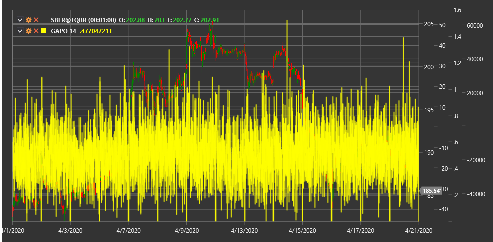

# GAPO

**Индекс диапазона Гопалакришнана (Gopalakrishnan Range Index, GAPO)** - это технический индикатор, разработанный Тушаром Гопалакришнаном для измерения волатильности рынка на основе логарифмической шкалы.

Для использования индикатора необходимо использовать класс [GopalakrishnanRangeIndex](xref:StockSharp.Algo.Indicators.GopalakrishnanRangeIndex).

## Описание

Индекс диапазона Гопалакришнана (GAPO) - это индикатор волатильности, который использует логарифмическую шкалу для измерения общего ценового диапазона за определенный период. Он был разработан Тушаром Гопалакришнаном и представлен в журнале "Technical Analysis of Stocks & Commodities".

GAPO оценивает экстремальные движения рынка, измеряя логарифмическое отношение между максимальной и минимальной ценами за заданный период. Этот подход позволяет индикатору более точно отражать увеличение волатильности, особенно в периоды резких ценовых движений.

Индикатор GAPO особенно полезен для:
- Определения периодов высокой и низкой волатильности
- Выявления потенциальных точек разворота после экстремальных движений
- Настройки параметров для других индикаторов, основанных на волатильности
- Адаптации торговых стратегий к текущим рыночным условиям

## Параметры

Индикатор имеет следующие параметры:
- **Length** - период расчета (стандартное значение: 10)

## Расчет

Расчет индекса диапазона Гопалакришнана достаточно прост:

```
GAPO = log(N) * log(Highest High - Lowest Low)
```

где:
- log - натуральный логарифм
- N - количество периодов (Length)
- Highest High - наивысший максимум за период Length
- Lowest Low - наинизший минимум за период Length

## Интерпретация

Индекс диапазона Гопалакришнана можно интерпретировать следующим образом:

1. **Абсолютные значения**:
   - Высокие значения GAPO указывают на периоды высокой волатильности
   - Низкие значения GAPO указывают на периоды низкой волатильности
   - Экстремально высокие значения могут указывать на возможное перенапряжение рынка и потенциальный разворот

2. **Тренды в GAPO**:
   - Возрастающие значения GAPO указывают на увеличение волатильности
   - Убывающие значения GAPO указывают на уменьшение волатильности
   - Резкий скачок GAPO может сигнализировать о начале нового трендового движения

3. **Относительные уровни**:
   - Сравнение текущего значения GAPO с его историческими уровнями позволяет оценить относительную волатильность
   - Значения выше 95-го процентиля исторического диапазона могут указывать на экстремальную волатильность
   - Значения ниже 5-го процентиля исторического диапазона могут указывать на необычно низкую волатильность

4. **Торговые стратегии**:
   - В периоды высокой волатильности (высокие значения GAPO) может быть целесообразно увеличить размер стоп-лоссов и целевых прибылей
   - В периоды низкой волатильности (низкие значения GAPO) может быть целесообразно использовать стратегии торговли в диапазоне
   - Экстремальные значения GAPO могут использоваться как противоположные индикаторы для поиска точек разворота

5. **Сочетание с другими индикаторами**:
   - GAPO может использоваться для фильтрации сигналов других индикаторов
   - В периоды высокой волатильности сигналы трендовых индикаторов могут быть более надежными
   - В периоды низкой волатильности сигналы осцилляторов могут быть более эффективными



## См. также

[ATR](atr.md)
[ChoppinessIndex](choppiness_index.md)
[HistoricalVolatility](historical_volatility.md)
[TrueRange](true_range.md)