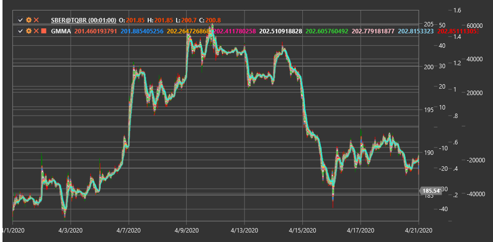

# GMMA

**Множественная скользящая средняя Guppy (Guppy Multiple Moving Average, GMMA)** - это технический индикатор, разработанный Дарилом Гуппи, который использует две группы экспоненциальных скользящих средних (EMA) для выявления взаимодействия между краткосрочными трейдерами и долгосрочными инвесторами.

Для использования индикатора необходимо использовать класс [GuppyMultipleMovingAverage](xref:StockSharp.Algo.Indicators.GuppyMultipleMovingAverage).

## Описание

Множественная скользящая средняя Guppy (GMMA) состоит из двух групп экспоненциальных скользящих средних (EMA):
1. **Краткосрочная группа** (обычно 3, 5, 8, 10, 12 и 15 периодов) - представляет активность краткосрочных трейдеров
2. **Долгосрочная группа** (обычно 30, 35, 40, 45, 50 и 60 периодов) - представляет активность долгосрочных инвесторов

GMMA позволяет визуализировать взаимодействие между этими двумя группами участников рынка и определить, находится ли рынок в трендовом состоянии или в состоянии консолидации. Индикатор также помогает выявить моменты, когда краткосрочные трейдеры начинают следовать в том же направлении, что и долгосрочные инвесторы, что часто указывает на формирование или усиление тренда.

GMMA особенно полезен для:
- Определения силы и направления текущего тренда
- Выявления потенциальных разворотов тренда
- Идентификации момента, когда рынок переходит от консолидации к тренду
- Определения оптимальных точек входа в существующий тренд

## Расчет

Расчет GMMA включает вычисление двух групп экспоненциальных скользящих средних:

1. Краткосрочная группа EMA:
   ```
   EMA_3 = EMA(Price, 3)
   EMA_5 = EMA(Price, 5)
   EMA_8 = EMA(Price, 8)
   EMA_10 = EMA(Price, 10)
   EMA_12 = EMA(Price, 12)
   EMA_15 = EMA(Price, 15)
   ```

2. Долгосрочная группа EMA:
   ```
   EMA_30 = EMA(Price, 30)
   EMA_35 = EMA(Price, 35)
   EMA_40 = EMA(Price, 40)
   EMA_45 = EMA(Price, 45)
   EMA_50 = EMA(Price, 50)
   EMA_60 = EMA(Price, 60)
   ```

где:
- EMA - экспоненциальное скользящее среднее
- Price - цена (обычно цена закрытия)

## Интерпретация

Интерпретация GMMA включает анализ как отдельных групп, так и их взаимодействия:

1. **Расположение групп**:
   - Когда краткосрочная группа находится выше долгосрочной, это указывает на восходящий тренд
   - Когда краткосрочная группа находится ниже долгосрочной, это указывает на нисходящий тренд

2. **Расстояние между группами**:
   - Большое расстояние между группами указывает на сильный тренд
   - Малое расстояние или пересечение групп указывает на слабый тренд или консолидацию

3. **Компрессия и экспансия**:
   - Компрессия (сближение) линий внутри группы указывает на неопределенность и возможную консолидацию
   - Экспансия (расхождение) линий внутри группы указывает на усиление тренда

4. **Пересечения**:
   - Пересечение краткосрочной группы через долгосрочную снизу вверх - сильный бычий сигнал
   - Пересечение краткосрочной группы через долгосрочную сверху вниз - сильный медвежий сигнал

5. **Изменение направления**:
   - Когда долгосрочная группа начинает менять направление, это указывает на значительное изменение в настроениях долгосрочных инвесторов
   - Разворот краткосрочной группы без изменений в долгосрочной группе часто указывает на временную коррекцию

6. **Оптимальные точки входа**:
   - После сильной экспансии может произойти компрессия, что указывает на коррекцию в рамках тренда
   - Окончание такой компрессии (новая экспансия) может быть хорошей точкой для входа в направлении основного тренда

7. **Раннее предупреждение о развороте**:
   - Первыми меняют направление краткосрочные средние, затем изменения начинают проявляться в долгосрочных средних
   - Пересечение между группами может служить подтверждением разворота



## См. также

[EMA](ema.md)
[MovingAverageRibbon](moving_average_ribbon.md)
[RainbowCharts](rainbow_charts.md)
[MACD](macd.md)