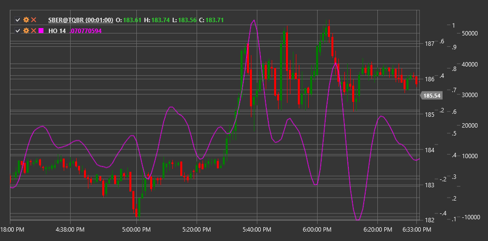

# HO

**Гармонический осциллятор (Harmonic Oscillator, HO)** - это технический индикатор, основанный на теории гармонических колебаний, который помогает выявлять циклические компоненты в движении цены.

Для использования индикатора необходимо использовать класс [HarmonicOscillator](xref:StockSharp.Algo.Indicators.HarmonicOscillator).

## Описание

Гармонический осциллятор (HO) - это индикатор, разработанный для выявления периодичности и циклической природы ценовых движений на рынке. Он основывается на принципе, что многие ценовые движения содержат гармонические (периодические) компоненты, которые можно выделить и использовать для прогнозирования будущих движений цены.

Индикатор применяет математические методы анализа спектра для декомпозиции ценового ряда на гармонические составляющие, выделяя доминирующие циклы. Затем он отображает эти циклические составляющие в виде осциллятора, который помогает трейдерам определить, когда цена может достичь локальных максимумов или минимумов в рамках выявленных циклов.

HO особенно полезен для:
- Определения циклической природы рынка
- Выявления потенциальных точек разворота
- Фильтрации рыночного шума
- Прогнозирования моментов, когда цена может изменить направление

## Параметры

Индикатор имеет следующие параметры:
- **Length** - период для анализа (стандартное значение: 30)

## Расчет

Расчет Гармонического осциллятора включает следующие этапы:

1. Предварительная обработка ценового ряда (детрендинг):
   ```
   Detrended Price = Price - SMA(Price, Length)
   ```

2. Применение спектрального анализа для выявления доминирующих циклов:
   ```
   Spectral Components = FFT(Detrended Price)
   ```
   
3. Выделение наиболее значимых гармонических компонентов:
   ```
   Dominant Cycles = Extract Top N Spectral Components based on amplitude
   ```

4. Синтез Гармонического осциллятора на основе доминирующих циклов:
   ```
   HO = Reconstruction of Dominant Cycles through Inverse FFT
   ```

где:
- Price - цена (обычно цена закрытия)
- SMA - простое скользящее среднее
- FFT - быстрое преобразование Фурье
- Length - период анализа

## Интерпретация

Гармонический осциллятор можно интерпретировать следующим образом:

1. **Пересечение нулевой линии**:
   - Когда HO пересекает нулевую линию снизу вверх, это может рассматриваться как бычий сигнал
   - Когда HO пересекает нулевую линию сверху вниз, это может рассматриваться как медвежий сигнал

2. **Экстремумы осциллятора**:
   - Когда HO достигает локального максимума, это может указывать на потенциальный пик цены
   - Когда HO достигает локального минимума, это может указывать на потенциальное дно цены

3. **Дивергенции**:
   - Бычья дивергенция: цена формирует новый минимум, а HO - более высокий минимум
   - Медвежья дивергенция: цена формирует новый максимум, а HO - более низкий максимум

4. **Проекция циклов**:
   - Регулярные пики и впадины HO могут использоваться для проекции будущих точек разворота
   - Анализ продолжительности между пиками/впадинами может помочь определить длину доминирующего цикла

5. **Изменение амплитуды**:
   - Увеличение амплитуды колебаний HO может указывать на усиление циклической компоненты
   - Уменьшение амплитуды колебаний HO может указывать на затухание циклической компоненты

6. **Сочетание с другими индикаторами**:
   - HO лучше всего работает в сочетании с трендовыми индикаторами
   - В трендовых рынках сигналы HO могут использоваться для определения точек входа в направлении тренда



## См. также

[SineWave](sine_wave.md)
[CenterOfGravityOscillator](center_of_gravity_oscillator.md)
[FisherTransform](ehlers_fisher_transform.md)
[DetrendedSyntheticPrice](detrended_synthetic_price.md)