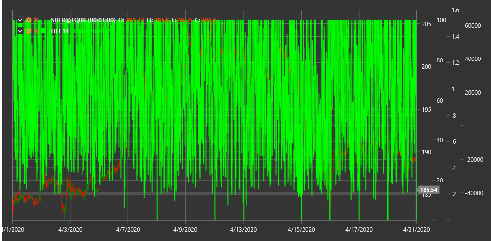

# HLI

**Индекс High Low (High Low Index, HLI)** - это технический индикатор, который измеряет отношение количества акций, достигших новых максимумов, к количеству акций, достигших новых минимумов, за определенный период времени.

Для использования индикатора необходимо использовать класс [HighLowIndex](xref:StockSharp.Algo.Indicators.HighLowIndex).

## Описание

Индекс High Low (HLI) является индикатором широты рынка, который анализирует общую рыночную активность, сравнивая количество инструментов, которые достигают новых максимумов, с количеством инструментов, которые достигают новых минимумов. Это позволяет оценить внутреннюю силу или слабость рынка.

Основная идея индикатора заключается в том, что здоровый рынок характеризуется большим количеством ценных бумаг, достигающих новых максимумов, чем новых минимумов. И наоборот, слабеющий рынок будет иметь больше ценных бумаг, достигающих новых минимумов.

HLI особенно полезен для:
- Оценки общего состояния рынка
- Выявления дивергенций между индексом и отдельными рыночными инструментами
- Определения потенциальных точек разворота рынка
- Подтверждения сигналов от других индикаторов

## Параметры

Индикатор имеет следующие параметры:
- **Length** - период расчета (стандартное значение: 14)

## Расчет

Расчет индекса High Low включает следующие этапы:

1. Подсчет количества ценных бумаг, достигших новых максимумов за период Length:
   ```
   New Highs = Количество инструментов, достигших новых максимумов за период Length
   ```

2. Подсчет количества ценных бумаг, достигших новых минимумов за период Length:
   ```
   New Lows = Количество инструментов, достигших новых минимумов за период Length
   ```

3. Расчет High Low Index как отношения разницы между новыми максимумами и минимумами к их сумме:
   ```
   HLI = ((New Highs - New Lows) / (New Highs + New Lows)) * 100
   ```

Примечание: Если (New Highs + New Lows) равно нулю, то HLI принимается равным нулю для избежания деления на ноль.

## Интерпретация

Индекс High Low интерпретируется следующим образом:

1. **Диапазон значений**:
   - HLI колеблется в диапазоне от -100 до +100
   - Положительные значения указывают на то, что больше ценных бумаг достигают новых максимумов, чем новых минимумов
   - Отрицательные значения указывают на то, что больше ценных бумаг достигают новых минимумов, чем новых максимумов

2. **Пересечение нулевой линии**:
   - Переход от отрицательных значений к положительным может рассматриваться как бычий сигнал
   - Переход от положительных значений к отрицательным может рассматриваться как медвежий сигнал

3. **Экстремальные значения**:
   - Значения близкие к +100 указывают на сильный бычий рынок (возможно перекупленность)
   - Значения близкие к -100 указывают на сильный медвежий рынок (возможно перепроданность)

4. **Дивергенции**:
   - Бычья дивергенция: рыночный индекс достигает нового минимума, но HLI формирует более высокий минимум
   - Медвежья дивергенция: рыночный индекс достигает нового максимума, но HLI формирует более низкий максимум

5. **Тренды в HLI**:
   - Устойчивый рост HLI указывает на усиление бычьего рынка
   - Устойчивое снижение HLI указывает на усиление медвежьего рынка

6. **Подтверждение рыночного тренда**:
   - Если рыночный индекс растет и HLI также растет, это подтверждает силу восходящего тренда
   - Если рыночный индекс падает и HLI также падает, это подтверждает силу нисходящего тренда



## См. также

[McClellanOscillator](mcclellan_oscillator.md)
[AdvanceDeclineLine](advance_decline_line.md)
[TickerVolume](ticker_volume.md)
[MarketBreadth](market_breadth.md)