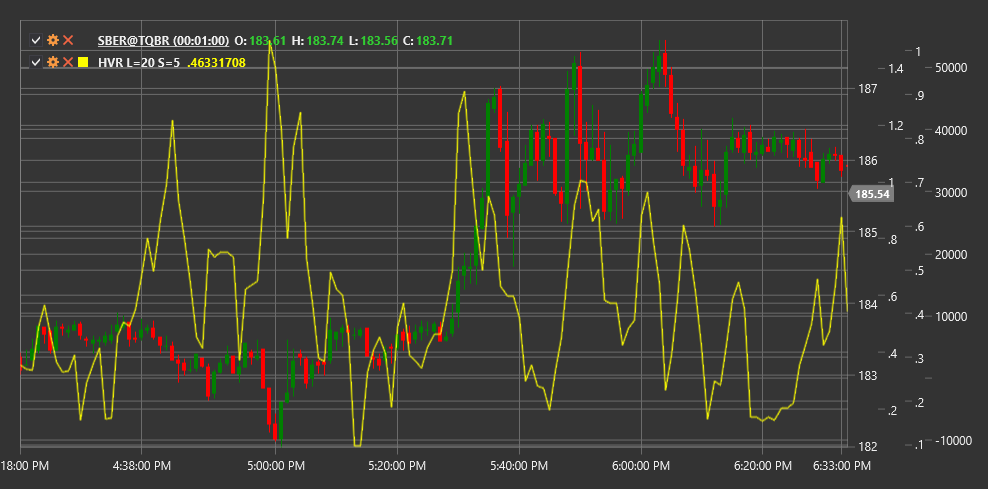

# HVR

**Коэффициент исторической волатильности (Historical Volatility Ratio, HVR)** - это технический индикатор, который сравнивает краткосрочную историческую волатильность с долгосрочной исторической волатильностью для оценки изменений в рыночной активности.

Для использования индикатора необходимо использовать класс [HistoricalVolatilityRatio](xref:StockSharp.Algo.Indicators.HistoricalVolatilityRatio).

## Описание

Коэффициент исторической волатильности (HVR) - это относительный индикатор волатильности, который сравнивает краткосрочную волатильность с долгосрочной волатильностью рынка. Индикатор помогает определить, увеличивается или уменьшается текущая волатильность относительно ее исторического уровня.

HVR рассчитывается как отношение краткосрочной исторической волатильности к долгосрочной исторической волатильности. Значения выше 1.0 указывают на то, что текущая (краткосрочная) волатильность выше, чем долгосрочная волатильность, что может сигнализировать о повышенной рыночной активности или потенциальном изменении тренда.

Индикатор особенно полезен для:
- Выявления периодов повышенной и пониженной волатильности
- Определения потенциальных точек разворота тренда
- Адаптации торговых стратегий к текущим рыночным условиям
- Оценки рыночного риска и установки адекватных размеров позиций

## Параметры

Индикатор имеет следующие параметры:
- **ShortPeriod** - период для расчета краткосрочной волатильности (стандартное значение: 5)
- **LongPeriod** - период для расчета долгосрочной волатильности (стандартное значение: 20)

## Расчет

Расчет коэффициента исторической волатильности включает следующие этапы:

1. Расчет краткосрочной исторической волатильности:
   ```
   Short-term Volatility = Standard Deviation of Log Returns over ShortPeriod * Sqrt(Trading Days Per Year)
   ```

2. Расчет долгосрочной исторической волатильности:
   ```
   Long-term Volatility = Standard Deviation of Log Returns over LongPeriod * Sqrt(Trading Days Per Year)
   ```

3. Расчет HVR как отношения краткосрочной волатильности к долгосрочной:
   ```
   HVR = Short-term Volatility / Long-term Volatility
   ```

где:
- Log Returns - логарифмические доходности (ln(Price[i] / Price[i-1]))
- Standard Deviation - стандартное отклонение
- Trading Days Per Year - количество торговых дней в году (обычно 252 для фондовых рынков)
- ShortPeriod - короткий период для расчета волатильности
- LongPeriod - длинный период для расчета волатильности

## Интерпретация

Коэффициент исторической волатильности можно интерпретировать следующим образом:

1. **Уровень 1.0**:
   - HVR = 1.0 означает, что краткосрочная волатильность равна долгосрочной волатильности
   - HVR > 1.0 указывает на то, что краткосрочная волатильность выше долгосрочной
   - HVR < 1.0 указывает на то, что краткосрочная волатильность ниже долгосрочной

2. **Экстремальные значения**:
   - Очень высокие значения HVR (например, > 2.0) могут указывать на резкое увеличение волатильности, что часто происходит во время рыночных паник или сильных движений
   - Очень низкие значения HVR (например, < 0.5) могут указывать на период сжатия волатильности, что часто предшествует сильным движениям

3. **Тренды в HVR**:
   - Растущий HVR указывает на увеличение текущей волатильности
   - Падающий HVR указывает на уменьшение текущей волатильности

4. **Торговые стратегии**:
   - Когда HVR высок, может быть целесообразно использовать стратегии, основанные на прорывах уровней
   - Когда HVR низок, может быть целесообразно использовать стратегии возврата к среднему или торговли в диапазоне

5. **Управление риском**:
   - Высокие значения HVR могут сигнализировать о необходимости уменьшения размера позиций из-за повышенной волатильности
   - Низкие значения HVR могут позволить увеличить размер позиций из-за пониженной волатильности

6. **Потенциальные развороты**:
   - Экстремальные значения HVR часто предшествуют значительным ценовым движениям
   - Резкое увеличение HVR после периода низкой волатильности может сигнализировать о начале нового тренда



## См. также

[ATR](atr.md)
[StandardDeviation](standard_deviation.md)
[ChoppinessIndex](choppiness_index.md)