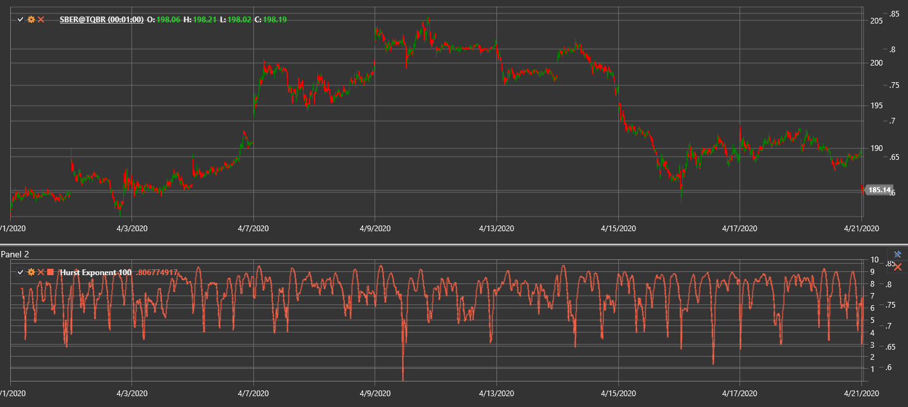

# HurstExponent

**Экспонента Херста (Hurst Exponent)** — статистическая мера, позволяющая оценить склонность временного ряда к трендовому поведению или возврату к среднему.

Для использования индикатора необходимо использовать класс [HurstExponent](xref:StockSharp.Algo.Indicators.HurstExponent).

## Описание

Значение экспоненты Херста (H) лежит в диапазоне от 0 до 1 и отражает "память" ряда:
- **H > 0.5** говорит о преобладании трендовых свойств.
- **H < 0.5** указывает на выраженную склонность к возврату к среднему.
- **H ≈ 0.5** соответствует случайному блужданию.

Индикатор помогает оценить эффективность рынка и выявить возможные циклы или зарождение трендов.

## Параметры

- **Length** – количество баров для расчета.

## Расчет

Один из распространённых способов основан на анализе нормированного размаха (R/S):
1. Для каждого окна длиной `Length` вычисляются накопленные отклонения от среднего.
2. Определяется размах `R` как разность между максимальным и минимальным накопленным отклонением.
3. Рассчитывается стандартное отклонение `S` в этом окне.
4. Вычисляется нормированный размах `R/S`.
5. Экспонента Херста определяется как наклон зависимости `log(R/S)` от `log(Length)`.

Большие значения `H` означают более выраженные тренды, а низкие — усиленный возврат к среднему.

## См. также

[Fractal Adaptive Moving Average](fractal_adaptive_moving_average.md)
[Market Meanness Index](market_meanness_index.md)
