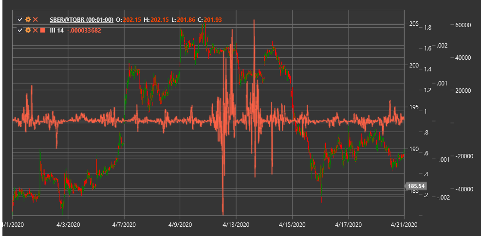

# III

**Индекс внутридневной интенсивности (Intraday Intensity Index, III)** - это технический индикатор, разработанный Дэвидом Бостианом, который оценивает соотношение между ценой закрытия, ценовым диапазоном и объемом торгов внутри торгового дня.

Для использования индикатора необходимо использовать класс [IntradayIntensityIndex](xref:StockSharp.Algo.Indicators.IntradayIntensityIndex).

## Описание

Индекс внутридневной интенсивности (III) сочетает информацию о ценовом движении и объеме торгов для оценки интенсивности покупательского или продавческого давления внутри торгового дня. Индикатор основан на предположении, что положение цены закрытия относительно ценового диапазона дня, в сочетании с объемом, может указывать на направление и силу рыночного движения.

III особенно полезен для выявления внутридневных изменений в настроениях рынка и определения потенциальных точек разворота. Положительные значения индикатора указывают на покупательское давление (цена закрытия ближе к максимуму дня), а отрицательные значения - на продавческое давление (цена закрытия ближе к минимуму дня).

Индекс внутридневной интенсивности особенно эффективен для:
- Выявления внутридневных изменений в рыночном настроении
- Определения потенциальных точек разворота
- Подтверждения сигналов от других индикаторов
- Оценки силы текущего тренда

## Параметры

Индикатор имеет следующие параметры:
- **Length** - период для сглаживания (стандартное значение: 14)

## Расчет

Расчет Индекса внутридневной интенсивности включает следующие этапы:

1. Расчет индивидуального значения III для каждого периода:
   ```
   III raw = ((2 * Close - High - Low) / ((High - Low) * Volume)) * Volume
   ```

2. Сглаживание с использованием простого скользящего среднего:
   ```
   III = SMA(III raw, Length)
   ```

где:
- Close - цена закрытия
- High - максимальная цена периода
- Low - минимальная цена периода
- Volume - объем торгов
- SMA - простое скользящее среднее
- Length - период сглаживания

## Интерпретация

Индекс внутридневной интенсивности можно интерпретировать следующим образом:

1. **Пересечение нулевой линии**:
   - Переход от отрицательных значений к положительным может рассматриваться как бычий сигнал, указывающий на усиление покупательского давления
   - Переход от положительных значений к отрицательным может рассматриваться как медвежий сигнал, указывающий на усиление продавческого давления

2. **Экстремальные значения**:
   - Высокие положительные значения указывают на сильное покупательское давление
   - Высокие отрицательные значения указывают на сильное продавческое давление
   - Экстремальные значения могут указывать на перекупленность или перепроданность рынка

3. **Дивергенции**:
   - Бычья дивергенция: цена формирует новый минимум, а III - более высокий минимум
   - Медвежья дивергенция: цена формирует новый максимум, а III - более низкий максимум

4. **Тренды в III**:
   - Устойчиво положительные значения III подтверждают восходящий тренд
   - Устойчиво отрицательные значения III подтверждают нисходящий тренд
   - Колебания около нулевой линии могут указывать на боковой тренд или неопределенность

5. **Комбинирование с другими индикаторами**:
   - III часто используется в сочетании с другими техническими индикаторами для подтверждения сигналов
   - Особенно эффективен в сочетании с индикаторами тренда и объема

6. **Анализ изменений в значениях**:
   - Быстрое изменение от отрицательных к положительным значениям может указывать на резкое изменение в настроениях рынка
   - Постепенное сближение с нулевой линией может указывать на затухание текущего импульса



## См. также

[IntradayMomentumIndex](intraday_momentum_index.md)
[BalanceOfPower](balance_of_power.md)
[ForceIndex](force_index.md)
[ChaikinMoneyFlow](chaikin_money_flow.md)