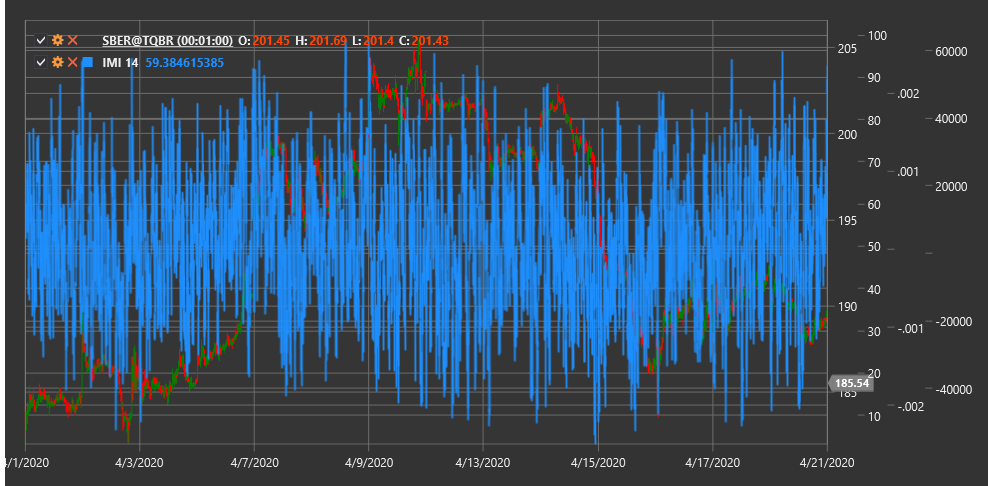

# IMI

**Индикатор внутридневного момента (Intraday Momentum Index, IMI)** - это технический индикатор, разработанный Тушаром Чанде, который объединяет принципы внутридневного ценообразования и концепцию RSI для измерения внутридневного импульса.

Для использования индикатора необходимо использовать класс [IntradayMomentumIndex](xref:StockSharp.Algo.Indicators.IntradayMomentumIndex).

## Описание

Индикатор внутридневного момента (IMI) был создан как модификация классического индекса относительной силы (RSI), специально адаптированная для анализа внутридневной динамики рынка. Вместо использования последовательных цен закрытия, как в традиционном RSI, IMI сравнивает цену закрытия с ценой открытия за каждый период.

IMI оценивает, насколько часто и насколько сильно цена закрытия превышает цену открытия (положительный импульс) или оказывается ниже цены открытия (отрицательный импульс) в течение заданного периода. Это позволяет выявить преобладающее направление и силу внутридневного движения.

Индикатор особенно полезен для:
- Определения внутридневного направления рынка
- Выявления потенциальных точек разворота
- Определения уровней перекупленности и перепроданности
- Обнаружения расхождений между ценой и импульсом

## Параметры

Индикатор имеет следующие параметры:
- **Length** - период расчета (стандартное значение: 14)

## Расчет

Расчет индикатора внутридневного момента включает следующие этапы:

1. Определение внутридневного движения цены:
   ```
   Gain = Close - Open, если Close > Open
   Loss = Open - Close, если Close < Open
   ```

2. Расчет суммы положительных и отрицательных движений за период Length:
   ```
   Sum Gains = Сумма всех Gain за период Length
   Sum Losses = Сумма всех Loss за период Length
   ```

3. Расчет IMI по формуле, аналогичной RSI:
   ```
   IMI = 100 * (Sum Gains / (Sum Gains + Sum Losses))
   ```

Примечание: Если (Sum Gains + Sum Losses) равно нулю, то IMI принимается равным 50 для избежания деления на ноль.

## Интерпретация

Индикатор внутридневного момента интерпретируется аналогично RSI:

1. **Диапазон значений**:
   - IMI колеблется в диапазоне от 0 до 100
   - Значения выше 50 указывают на преобладание положительного внутридневного импульса
   - Значения ниже 50 указывают на преобладание отрицательного внутридневного импульса

2. **Уровни перекупленности и перепроданности**:
   - Значения выше 70 обычно рассматриваются как указание на перекупленность рынка
   - Значения ниже 30 обычно рассматриваются как указание на перепроданность рынка

3. **Пересечение центральной линии**:
   - Пересечение линии 50 снизу вверх может рассматриваться как бычий сигнал
   - Пересечение линии 50 сверху вниз может рассматриваться как медвежий сигнал

4. **Дивергенции**:
   - Бычья дивергенция: цена формирует новый минимум, а IMI - более высокий минимум
   - Медвежья дивергенция: цена формирует новый максимум, а IMI - более низкий максимум

5. **Неудачные свинги**:
   - Если IMI не может достичь уровня перекупленности во время восходящего тренда, это может указывать на слабость тренда
   - Если IMI не может достичь уровня перепроданности во время нисходящего тренда, это может указывать на слабость тренда

6. **Подтверждение тренда**:
   - Устойчивые значения IMI выше 50 подтверждают восходящий тренд
   - Устойчивые значения IMI ниже 50 подтверждают нисходящий тренд



## См. также

[RSI](rsi.md)
[IntradayIntensityIndex](intraday_intensity_index.md)
[Momentum](momentum.md)
[RelativeMomentumIndex](relative_momentum_index.md)