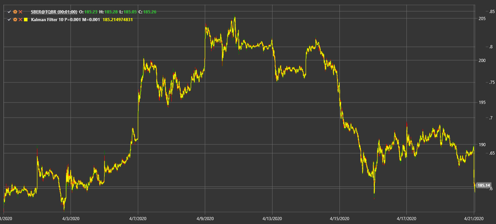

# KalmanFilter

**Фильтр Калмана (Kalman Filter)** — рекурсивный алгоритм, позволяющий оценивать скрытое состояние системы по зашумленным наблюдениям.

Для использования индикатора необходимо использовать класс [KalmanFilter](xref:StockSharp.Algo.Indicators.KalmanFilter).

## Описание

Фильтр Калмана выполняет цикл «прогноз–коррекция», сглаживая ценовые данные и снижая рыночный шум. Он динамически адаптируется по мере поступления новой информации, что полезно для отслеживания трендов в условиях высокой волатильности.

## Параметры

- **ProcessNoise** — ожидаемая дисперсия процесса.
- **ObservationNoise** — ожидаемая дисперсия наблюдаемых данных.

## Расчет

На каждом шаге фильтр выполняет:
1. **Прогноз** следующего состояния на основе предыдущей оценки.
2. **Обновление** прогноза с учетом новой цены и заданных уровней шума.

Так получается оптимизированная оценка, которая быстро реагирует на изменения цены, отфильтровывая краткосрочные колебания.

## См. также

[Kaufman Adaptive Moving Average](kama.md)
[Adaptive Laguerre Filter](adaptive_laguerre_filter.md)
