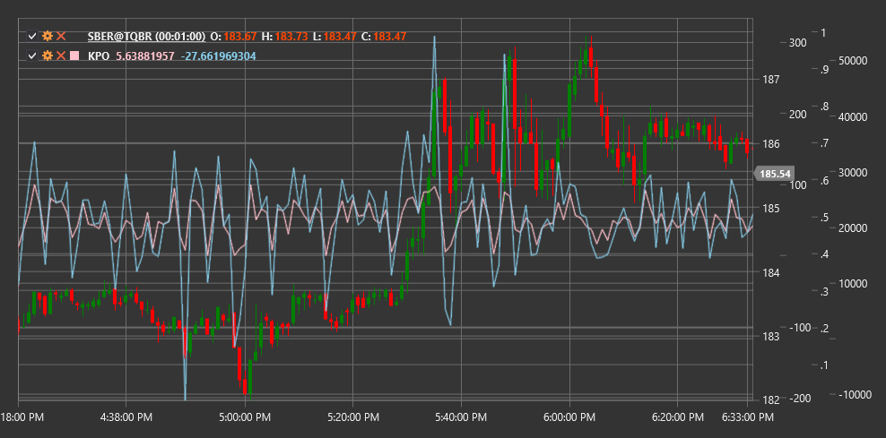

# KPO

**Осциллятор пика Кейс (Kase Peak Oscillator, KPO)** - это технический индикатор, разработанный Селией Кейс, который сочетает импульс и волатильность для определения потенциальных пиков и впадин на рынке.

Для использования индикатора необходимо использовать класс [KasePeakOscillator](xref:StockSharp.Algo.Indicators.KasePeakOscillator).

## Описание

Осциллятор пика Кейс (KPO) - это инструмент для определения перекупленных и перепроданных условий на рынке, а также для выявления потенциальных точек разворота. Он был разработан трейдером и инженером Селией Кейс как часть ее торговой методологии.

KPO основан на концепции, что рыночные пики и впадины формируются, когда импульс движения цены начинает исчерпываться. Осциллятор использует сочетание показателей импульса и волатильности для выявления этих ключевых точек поворота.

Индикатор представляет собой безразмерный осциллятор, который колеблется вокруг нулевой линии. Положительные значения указывают на восходящий импульс, а отрицательные значения - на нисходящий импульс. Экстремальные значения осциллятора часто совпадают с пиками и впадинами на графике цены.

## Параметры

Индикатор имеет следующие параметры:
- **ShortPeriod** - короткий период для расчета импульса (стандартное значение: 10)
- **LongPeriod** - длинный период для расчета импульса (стандартное значение: 30)

## Расчет

Расчет Осциллятора пика Кейс включает несколько этапов:

1. Расчет показателя краткосрочного импульса на основе короткого периода:
   ```
   Short Momentum = EMA(Price, ShortPeriod) - EMA(Price, ShortPeriod)[previous]
   ```

2. Расчет показателя долгосрочного импульса на основе длинного периода:
   ```
   Long Momentum = EMA(Price, LongPeriod) - EMA(Price, LongPeriod)[previous]
   ```

3. Расчет текущей волатильности:
   ```
   Volatility = ATR(ShortPeriod)
   ```

4. Нормализация импульса относительно волатильности:
   ```
   Normalized Short Momentum = Short Momentum / Volatility
   Normalized Long Momentum = Long Momentum / Volatility
   ```

5. Итоговый расчет KPO:
   ```
   KPO = Normalized Short Momentum - Normalized Long Momentum
   ```

где:
- Price - обычно используется цена закрытия
- EMA - экспоненциальное скользящее среднее
- ATR - средний истинный диапазон
- ShortPeriod - короткий период расчета
- LongPeriod - длинный период расчета

## Интерпретация

Осциллятор пика Кейс можно интерпретировать следующим образом:

1. **Пересечение нулевой линии**:
   - Пересечение снизу вверх может рассматриваться как бычий сигнал
   - Пересечение сверху вниз может рассматриваться как медвежий сигнал

2. **Экстремальные значения**:
   - Высокие положительные значения могут указывать на перекупленность рынка и потенциальный разворот вниз
   - Высокие отрицательные значения могут указывать на перепроданность рынка и потенциальный разворот вверх

3. **Дивергенции**:
   - Бычья дивергенция (цена формирует новый минимум, а KPO - более высокий минимум) может сигнализировать о предстоящем восходящем развороте
   - Медвежья дивергенция (цена формирует новый максимум, а KPO - более низкий максимум) может сигнализировать о предстоящем нисходящем развороте

4. **Пересечение между компонентами**:
   - Когда краткосрочный импульс пересекает долгосрочный импульс снизу вверх, это может рассматриваться как бычий сигнал
   - Когда краткосрочный импульс пересекает долгосрочный импульс сверху вниз, это может рассматриваться как медвежий сигнал

5. **Ускорение и замедление**:
   - Увеличение наклона KPO указывает на ускорение импульса
   - Уменьшение наклона KPO указывает на замедление импульса, что может предшествовать развороту

6. **Комбинирование с другими индикаторами**:
   - KPO часто используется вместе с другими техническими индикаторами для подтверждения сигналов
   - Особенно эффективно сочетание с индикаторами тренда и уровнями поддержки/сопротивления



## См. также

[MomentumOscillator](momentum.md)
[MACD](macd.md)
[PrettyGoodOscillator](pretty_good_oscillator.md)
[ATR](atr.md)