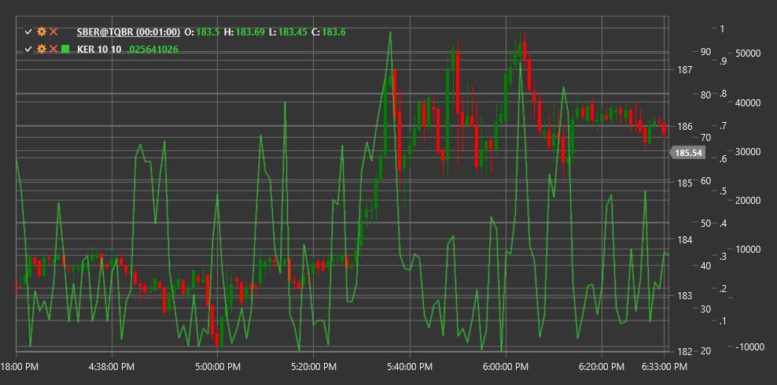

# KER

**Коэффициент эффективности Кауфмана (Kaufman Efficiency Ratio, KER)** - это технический индикатор, разработанный Перри Кауфманом, который измеряет эффективность ценового движения, сравнивая направленное движение цены с общей волатильностью.

Для использования индикатора необходимо использовать класс [KaufmanEfficiencyRatio](xref:StockSharp.Algo.Indicators.KaufmanEfficiencyRatio).

## Описание

Коэффициент эффективности Кауфмана (KER) оценивает, насколько "эффективно" цена движется в определенном направлении по сравнению с общим путем, который она проходит. Он представляет собой отношение чистого направленного движения цены к сумме всех ценовых изменений за определенный период.

KER был разработан Перри Кауфманом и первоначально использовался как компонент индикатора Adaptive Moving Average (KAMA). Однако сам по себе KER является ценным инструментом, который помогает определить, находится ли рынок в трендовом или колебательном состоянии.

Значения KER колеблются от 0 до 1:
- Значения, близкие к 1, указывают на высокоэффективное движение цены (сильный тренд)
- Значения, близкие к 0, указывают на неэффективное движение цены (боковой рынок или высокая волатильность)

## Параметры

Индикатор имеет следующие параметры:
- **Length** - период для расчета эффективности (стандартное значение: 10)

## Расчет

Расчет Коэффициента эффективности Кауфмана включает следующие этапы:

1. Расчет направленного движения (чистого изменения) за период:
   ```
   Direction = |Price[current] - Price[current - Length]|
   ```

2. Расчет общего движения (суммы всех изменений) за период:
   ```
   Volatility = Sum(|Price[i] - Price[i-1]|) для i от (current - Length + 1) до current
   ```

3. Расчет коэффициента эффективности:
   ```
   KER = Direction / Volatility
   ```

где:
- Price - обычно используется цена закрытия
- Length - период расчета
- | | - обозначение модуля (абсолютного значения)

Если Volatility равно нулю (что маловероятно), KER принимается равным нулю для избежания деления на ноль.

## Интерпретация

Коэффициент эффективности Кауфмана можно интерпретировать следующим образом:

1. **Уровни эффективности**:
   - Высокие значения KER (>0.6) указывают на сильный тренд
   - Средние значения KER (0.3-0.6) указывают на умеренный тренд
   - Низкие значения KER (<0.3) указывают на боковой рынок или высокую волатильность

2. **Изменения в KER**:
   - Рост KER может сигнализировать о формировании или усилении тренда
   - Падение KER может сигнализировать об ослаблении тренда или переходе к боковому движению

3. **Торговые стратегии**:
   - В периоды высокой эффективности (высокий KER) предпочтительны трендовые стратегии
   - В периоды низкой эффективности (низкий KER) предпочтительны стратегии торговли в диапазоне

4. **Фильтрация сигналов**:
   - KER может использоваться для фильтрации сигналов других индикаторов
   - Сигналы трендовых индикаторов более надежны при высоком KER
   - Сигналы осцилляторов более надежны при низком KER

5. **Адаптация к рыночным условиям**:
   - KER позволяет адаптировать торговые стратегии к изменяющимся рыночным условиям
   - Трейдеры могут динамически корректировать параметры других индикаторов на основе значений KER

6. **Предвестник изменений**:
   - Резкое изменение KER часто предшествует новому ценовому движению
   - Падение KER после периода высоких значений может предупреждать о потенциальном развороте тренда



## См. также

[KAMA](kama.md)
[ADX](adx.md)
[VHF](vhf.md)
[VIDYA](vidya.md)