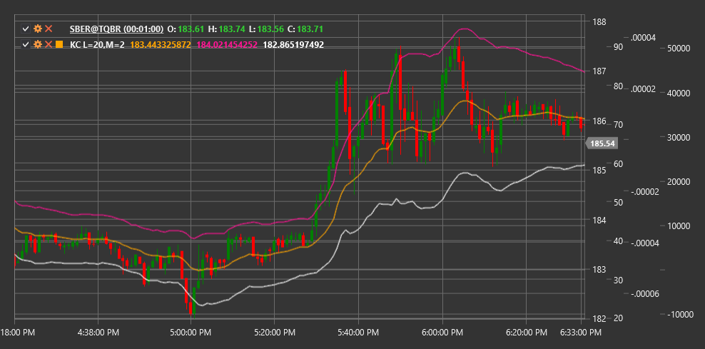

# KC

**Индикатор каналов Келтнера (Keltner Channels, KC)** - это технический индикатор, представляющий собой набор полос волатильности, который использует экспоненциальное скользящее среднее (EMA) в качестве центральной линии и средний истинный диапазон (ATR) для определения ширины канала.

Для использования индикатора необходимо использовать класс [KeltnerChannels](xref:StockSharp.Algo.Indicators.KeltnerChannels).

## Описание

Каналы Келтнера - это набор трех линий:
1. **Центральная линия**: обычно представлена 20-периодным EMA
2. **Верхняя полоса**: центральная линия плюс некоторый множитель ATR
3. **Нижняя полоса**: центральная линия минус тот же множитель ATR

Индикатор был разработан Честером Келтнером в 1960-х годах и позже был модифицирован Линдой Рашке, которая заменила простое скользящее среднее (SMA) на экспоненциальное скользящее среднее (EMA) и стала использовать ATR вместо диапазона High-Low для расчета ширины канала.

Каналы Келтнера помогают трейдерам определить направление тренда и потенциальные уровни поддержки и сопротивления. Они также используются для выявления условий перекупленности и перепроданности, когда цена касается или пробивает верхнюю или нижнюю полосу соответственно.

## Параметры

Индикатор имеет следующие параметры:
- **Length** - период для расчета EMA и ATR (стандартное значение: 20)
- **Multiplier** - множитель для ATR, определяющий ширину канала (стандартное значение: 2.0)

## Расчет

Расчет Каналов Келтнера включает следующие этапы:

1. Расчет экспоненциального скользящего среднего:
   ```
   Middle Line = EMA(Price, Length)
   ```

2. Расчет среднего истинного диапазона:
   ```
   ATR = Average True Range за период Length
   ```

3. Расчет верхней и нижней полос:
   ```
   Upper Band = Middle Line + (Multiplier * ATR)
   Lower Band = Middle Line - (Multiplier * ATR)
   ```

где:
- Price - обычно используется цена закрытия
- EMA - экспоненциальное скользящее среднее
- ATR - средний истинный диапазон
- Length - период для расчета EMA и ATR
- Multiplier - множитель, определяющий ширину канала

## Интерпретация

Каналы Келтнера можно интерпретировать следующим образом:

1. **Направление тренда**:
   - Когда все три линии направлены вверх, это указывает на восходящий тренд
   - Когда все три линии направлены вниз, это указывает на нисходящий тренд
   - Горизонтальное движение линий указывает на боковой тренд

2. **Прорывы**:
   - Пробой цены выше верхней полосы может указывать на сильный восходящий импульс
   - Пробой цены ниже нижней полосы может указывать на сильный нисходящий импульс
   - Пробои часто используются как сигналы для входа в позицию в направлении пробоя

3. **Возвраты к средней линии**:
   - После пробоя верхней или нижней полосы цена часто возвращается к средней линии
   - Средняя линия может служить уровнем поддержки или сопротивления

4. **Перекупленность и перепроданность**:
   - Цена вблизи или за пределами верхней полосы может указывать на перекупленность
   - Цена вблизи или за пределами нижней полосы может указывать на перепроданность
   - В трендовых рынках цена может долго оставаться в "экстремальных" зонах

5. **Сужение и расширение канала**:
   - Сужение канала (уменьшение расстояния между полосами) указывает на уменьшение волатильности, что часто предшествует сильному движению цены
   - Расширение канала указывает на увеличение волатильности

6. **Торговые стратегии**:
   - Стратегия "от края к средней": открытие позиции при касании ценой верхней или нижней полосы с целью движения к средней линии
   - Стратегия прорыва: открытие позиции при пробое ценой верхней или нижней полосы с ожиданием продолжения движения в том же направлении
   - Стратегия "от средней к краю": открытие позиции при отскоке от средней линии с целью движения к верхней или нижней полосе



## См. также

[BollingerBands](bollinger_bands.md)
[DonchianChannels](donchian_channels.md)
[EMA](ema.md)
[ATR](atr.md)