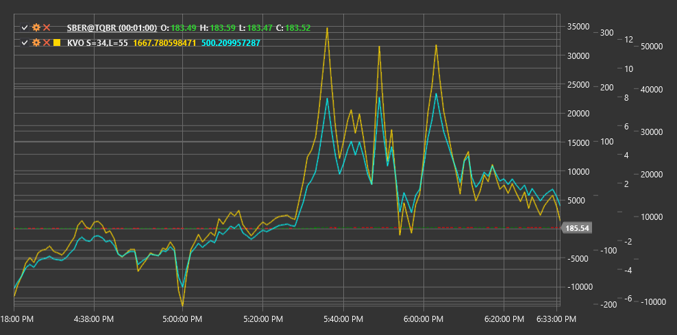

# KVO

**Объемный осциллятор Клингера (Klinger Volume Oscillator, KVO)** - это технический индикатор, разработанный Стефеном Клингером, который использует объем и цену для определения долгосрочных тенденций и краткосрочных разворотов на рынке.

Для использования индикатора необходимо использовать класс [KlingerVolumeOscillator](xref:StockSharp.Algo.Indicators.KlingerVolumeOscillator).

## Описание

Объемный осциллятор Клингера (KVO) был создан Стефеном Клингером для измерения расхождения между объемом и ценой. В основе индикатора лежит концепция, что движение цены подтверждается объемом. KVO стремится определить не только направление тренда, но и его силу и потенциальные точки разворота.

KVO объединяет информацию о цене с объемом, используя показатель денежного потока объема (Volume Force), который учитывает как направление, так и величину ценового движения, а также объем торгов. Затем он применяет экспоненциальные скользящие средние (EMA) с двумя разными периодами к этому денежному потоку и вычисляет разницу между ними.

Индикатор представляет собой осциллятор, который колеблется выше и ниже нулевой линии. Положительные значения KVO указывают на то, что покупатели контролируют рынок, а отрицательные значения - на то, что продавцы имеют преимущество.

## Параметры

Индикатор имеет следующие параметры:
- **ShortPeriod** - период для расчета короткой EMA (стандартное значение: 34)
- **LongPeriod** - период для расчета длинной EMA (стандартное значение: 55)

## Расчет

Расчет Объемного осциллятора Клингера включает несколько этапов:

1. Определение тренда для каждого периода:
   ```
   Trend = +1, если (High + Low + Close) > (High[previous] + Low[previous] + Close[previous])
   Trend = -1, в противном случае
   ```

2. Расчет показателя денежного потока объема (Volume Force):
   ```
   Volume Force = Volume * Trend * abs(2 * ((Close - Low) - (High - Close)) / (High - Low))
   ```
   Если (High - Low) равно нулю, то Volume Force принимается равным объему, умноженному на тренд.

3. Расчет EMA для двух периодов:
   ```
   Short EMA = EMA(Volume Force, ShortPeriod)
   Long EMA = EMA(Volume Force, LongPeriod)
   ```

4. Итоговый расчет KVO:
   ```
   KVO = Short EMA - Long EMA
   ```

5. Расчет сигнальной линии (опционально):
   ```
   Signal Line = EMA(KVO, 13)
   ```

где:
- High, Low, Close - максимальная, минимальная и закрывающая цены
- Volume - объем торгов
- EMA - экспоненциальное скользящее среднее
- ShortPeriod - период для короткой EMA
- LongPeriod - период для длинной EMA

## Интерпретация

Объемный осциллятор Клингера можно интерпретировать следующим образом:

1. **Пересечение нулевой линии**:
   - Пересечение KVO нулевой линии снизу вверх может рассматриваться как бычий сигнал
   - Пересечение KVO нулевой линии сверху вниз может рассматриваться как медвежий сигнал

2. **Пересечение сигнальной линии**:
   - Пересечение KVO сигнальной линии снизу вверх может рассматриваться как бычий сигнал входа
   - Пересечение KVO сигнальной линии сверху вниз может рассматриваться как медвежий сигнал входа

3. **Дивергенции**:
   - Бычья дивергенция: цена формирует новый минимум, а KVO - более высокий минимум
   - Медвежья дивергенция: цена формирует новый максимум, а KVO - более низкий максимум

4. **Подтверждение тренда**:
   - Положительные значения KVO подтверждают восходящий тренд
   - Отрицательные значения KVO подтверждают нисходящий тренд

5. **Сила тренда**:
   - Увеличение значения KVO (как положительного, так и отрицательного) указывает на усиление текущего тренда
   - Уменьшение значения KVO указывает на ослабление текущего тренда

6. **Потенциальные развороты**:
   - Экстремальные значения KVO могут указывать на перекупленность или перепроданность рынка и потенциальный разворот
   - Замедление роста или падения KVO может предшествовать развороту тренда

7. **Объем и цена**:
   - KVO позволяет оценить согласованность движения цены и объема
   - Сильный объем в направлении тренда приводит к более экстремальным значениям KVO



## См. также

[OBV](obv.md)
[ChaikinMoneyFlow](chaikin_money_flow.md)
[ADL](accumulation_distribution_line.md)
[ForceIndex](force_index.md)