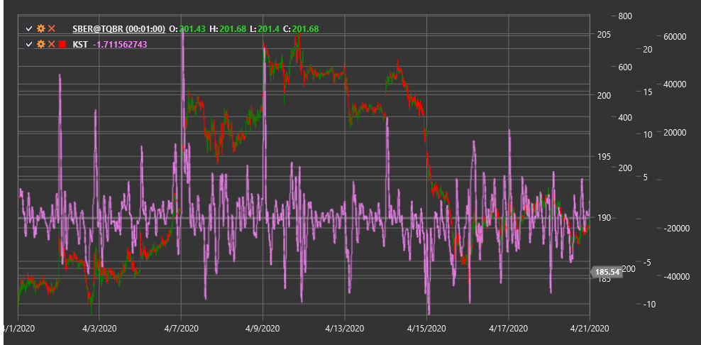

# KST

**Знать верную вещь (Know Sure Thing, KST)** - это технический индикатор, разработанный Мартином Прингом, который представляет собой сумму четырех сглаженных скоростей изменения (ROC) с разными периодами для выявления долгосрочных циклов на рынке.

Для использования индикатора необходимо использовать класс [KnowSureThing](xref:StockSharp.Algo.Indicators.KnowSureThing).

## Описание

Индикатор Know Sure Thing (KST) представляет собой осциллятор, разработанный Мартином Прингом для выявления трендов путем измерения ценового импульса на различных временных периодах. Индикатор объединяет четыре показателя скорости изменения (ROC) с разными периодами, придавая большую значимость более длинным периодам.

KST основан на теории, что рыночные циклы разной продолжительности оказывают совокупное влияние на движение цены. Сочетая ROC разных периодов, KST стремится выявить долгосрочные циклические тенденции и определить потенциальные точки разворота.

Индикатор обычно дополняется сигнальной линией (скользящим средним от KST), и их пересечения могут использоваться для генерации торговых сигналов.

## Расчет

Расчет индикатора KST включает следующие этапы:

1. Расчет четырех показателей скорости изменения (ROC) с разными периодами:
   ```
   ROC1 = ((Close / Close[n1 periods ago]) - 1) * 100
   ROC2 = ((Close / Close[n2 periods ago]) - 1) * 100
   ROC3 = ((Close / Close[n3 periods ago]) - 1) * 100
   ROC4 = ((Close / Close[n4 periods ago]) - 1) * 100
   ```

2. Сглаживание каждого ROC с помощью простого скользящего среднего (SMA):
   ```
   RCMA1 = SMA(ROC1, m1)
   RCMA2 = SMA(ROC2, m2)
   RCMA3 = SMA(ROC3, m3)
   RCMA4 = SMA(ROC4, m4)
   ```

3. Взвешенное суммирование для получения KST:
   ```
   KST = (RCMA1 * 1) + (RCMA2 * 2) + (RCMA3 * 3) + (RCMA4 * 4)
   ```

4. Расчет сигнальной линии:
   ```
   Signal Line = SMA(KST, signal period)
   ```

где:
- Close - цена закрытия
- n1, n2, n3, n4 - периоды для расчета ROC (стандартные значения: 10, 15, 20, 30)
- m1, m2, m3, m4 - периоды для сглаживания ROC (стандартные значения: 10, 10, 10, 15)
- signal period - период для сигнальной линии (стандартное значение: 9)

## Интерпретация

Индикатор KST можно интерпретировать следующим образом:

1. **Пересечение нулевой линии**:
   - Когда KST пересекает нулевую линию снизу вверх, это может рассматриваться как бычий сигнал
   - Когда KST пересекает нулевую линию сверху вниз, это может рассматриваться как медвежий сигнал

2. **Пересечение с сигнальной линией**:
   - Когда KST пересекает сигнальную линию снизу вверх, это может рассматриваться как бычий сигнал (более чувствительный, чем пересечение нулевой линии)
   - Когда KST пересекает сигнальную линию сверху вниз, это может рассматриваться как медвежий сигнал (более чувствительный, чем пересечение нулевой линии)

3. **Дивергенции**:
   - Бычья дивергенция: цена формирует новый минимум, а KST - более высокий минимум
   - Медвежья дивергенция: цена формирует новый максимум, а KST - более низкий максимум

4. **Экстремальные значения**:
   - Высокие положительные значения KST могут указывать на перекупленность рынка
   - Высокие отрицательные значения KST могут указывать на перепроданность рынка

5. **Направление движения**:
   - Восходящий тренд KST указывает на общее бычье настроение рынка
   - Нисходящий тренд KST указывает на общее медвежье настроение рынка

6. **Подтверждение тренда**:
   - KST может использоваться для подтверждения сигналов других индикаторов
   - Согласованность направления KST и цены подтверждает силу текущего тренда

7. **Анализ настроения рынка**:
   - Положительные значения KST указывают на преобладание бычьего настроения
   - Отрицательные значения KST указывают на преобладание медвежьего настроения



## См. также

[ROC](roc.md)
[MACD](macd.md)
[Momentum](momentum.md)
[RSI](rsi.md)