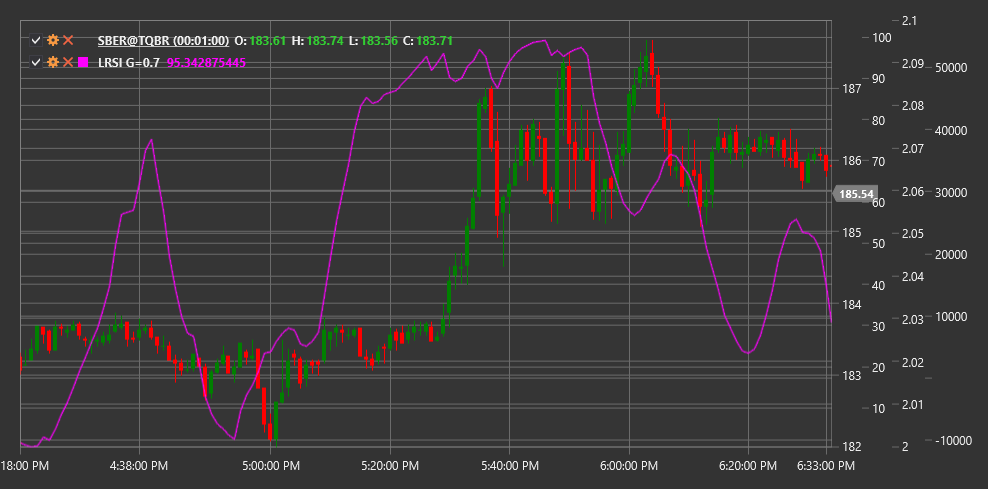

# LRSI

**Laguerre RSI (LRSI)** - это технический индикатор, основанный на математических принципах фильтров Лагерра, разработанный Джоном Элерсом как усовершенствованная версия традиционного индекса относительной силы (RSI).

Для использования индикатора необходимо использовать класс [LaguerreRSI](xref:StockSharp.Algo.Indicators.LaguerreRSI).

## Описание

Laguerre RSI (LRSI) представляет собой инновационный осциллятор, который использует математику фильтров Лагерра для создания более чувствительного и меньше запаздывающего индикатора по сравнению с традиционным RSI. Джон Элерс разработал этот индикатор, чтобы решить проблему задержки сигналов, присущую многим техническим индикаторам.

LRSI сочетает принципы полиномов Лагерра с концепцией индекса относительной силы. Это позволяет индикатору быстрее реагировать на изменения тренда и формировать более четкие сигналы торговли. Как и традиционный RSI, LRSI колеблется в диапазоне от 0 до 1 (или от 0 до 100 при умножении на 100), но имеет менее зашумленную структуру и более четкие повороты.

Основное преимущество LRSI заключается в его способности быстрее выявлять изменения в тренде при сохранении стабильности сигнала. Это делает его особенно полезным для краткосрочной торговли и определения точек входа и выхода.

## Параметры

Индикатор имеет следующие параметры:
- **Gamma** - коэффициент фильтрации (стандартное значение: 0.4, диапазон от 0.1 до 0.9)

Параметр Gamma определяет степень фильтрации и влияет на чувствительность индикатора. Меньшие значения Gamma приводят к более сглаженному и менее чувствительному индикатору, в то время как большие значения делают индикатор более чувствительным к изменениям цены, но потенциально более зашумленным.

## Расчет

Расчет Laguerre RSI включает несколько этапов:

1. Инициализация четырех значений фильтра Лагерра (L0, L1, L2, L3) при первом запуске:
   ```
   L0 = L1 = L2 = L3 = 0
   ```

2. Обновление значений фильтра Лагерра для каждой новой цены:
   ```
   L0_new = (1 - Gamma) * Price + Gamma * L0_old
   L1_new = -Gamma * L0_new + L0_old + Gamma * L1_old
   L2_new = -Gamma * L1_new + L1_old + Gamma * L2_old
   L3_new = -Gamma * L2_new + L2_old + Gamma * L3_old
   ```

3. Расчет "кумулятивного умножения" фильтрованных значений:
   ```
   CU = (L0_new + L1_new + L2_new + L3_new) / 4
   ```

4. Разделение на "вверх" и "вниз" компоненты:
   ```
   Если CU >= CU_old, то:
     UP = CU - CU_old
     DN = 0
   Иначе:
     UP = 0
     DN = CU_old - CU
   ```

5. Итоговый расчет LRSI:
   ```
   LRSI = UP / (UP + DN)
   ```
   
   Если (UP + DN) равно нулю, то LRSI принимается равным предыдущему значению.

где:
- Price - входная цена (обычно цена закрытия)
- Gamma - параметр фильтрации
- CU - "кумулятивное умножение"

## Интерпретация

Laguerre RSI интерпретируется аналогично традиционному RSI, но с учетом его повышенной чувствительности:

1. **Уровни перекупленности и перепроданности**:
   - Значения выше 0.8 (или 80) обычно считаются индикатором перекупленности
   - Значения ниже 0.2 (или 20) обычно считаются индикатором перепроданности
   - Из-за характеристик фильтра Лагерра, эти уровни могут быть скорректированы в зависимости от волатильности рынка

2. **Пересечение центральной линии**:
   - Пересечение уровня 0.5 (или 50) снизу вверх может рассматриваться как бычий сигнал
   - Пересечение уровня 0.5 (или 50) сверху вниз может рассматриваться как медвежий сигнал

3. **Дивергенции**:
   - Бычья дивергенция: цена формирует новый минимум, а LRSI - более высокий минимум
   - Медвежья дивергенция: цена формирует новый максимум, а LRSI - более низкий максимум

4. **Отскоки от экстремумов**:
   - Разворот LRSI от уровней перекупленности или перепроданности может служить сигналом для входа в рынок

5. **Подтверждение тренда**:
   - Значения LRSI выше 0.5 подтверждают восходящий тренд
   - Значения LRSI ниже 0.5 подтверждают нисходящий тренд

6. **Настройка параметра Gamma**:
   - Для более быстрых сигналов - увеличить Gamma (ближе к 0.9)
   - Для более сглаженных сигналов - уменьшить Gamma (ближе к 0.1)



## См. также

[RSI](rsi.md)
[AdaptiveLaguerreFilter](adaptive_laguerre_filter.md)
[ConnorsRSI](connors_rsi.md)