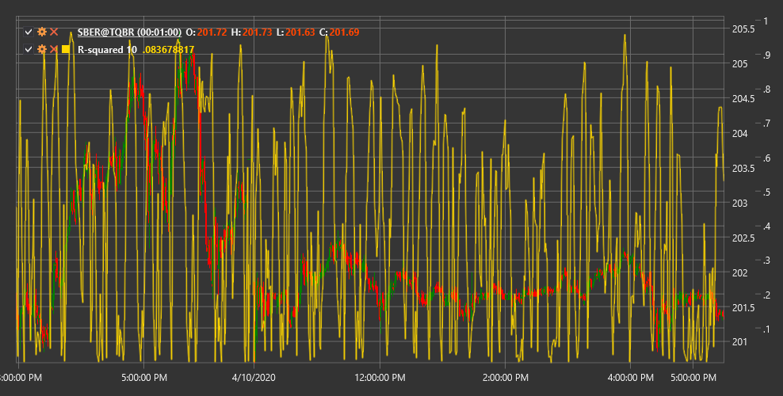

# R-квадрат

**R-квадрат в линейной регрессии (Linear Regression R-Squared)** - это технический индикатор, который измеряет, насколько хорошо линейная регрессия аппроксимирует ценовые данные, и определяет силу тренда на рынке.

Для использования индикатора необходимо использовать класс [LinearRegRSquared](xref:StockSharp.Algo.Indicators.LinearRegRSquared).

## Описание

R-квадрат в линейной регрессии (R²) - это статистический показатель, используемый для оценки степени соответствия между ценовыми данными и линией линейной регрессии, проведенной через эти данные. В контексте технического анализа, R² показывает, насколько хорошо текущее движение цены соответствует линейному тренду.

Значения R² находятся в диапазоне от 0 до 1 (или от 0% до 100%):
- Значение близкое к 1 (100%) указывает на то, что цены очень хорошо выстраиваются вдоль линии тренда, что свидетельствует о сильном тренде
- Значение близкое к 0 указывает на отсутствие линейного тренда и характерно для боковых, хаотичных или циклических рынков

Индикатор помогает трейдерам отличить периоды сильного тренда от периодов консолидации или боковых движений, что позволяет выбрать соответствующую торговую стратегию.

## Параметры

Индикатор имеет следующие параметры:
- **Length** - период для расчета линейной регрессии (стандартное значение: 14)

## Расчет

Расчет R-квадрата в линейной регрессии включает следующие этапы:

1. Построение линии линейной регрессии для ценовых данных за период Length:
   ```
   y = a + b*x
   ```
   где:
   - y - цена (зависимая переменная)
   - x - порядковый номер периода (независимая переменная)
   - a - свободный член (точка пересечения с осью y)
   - b - коэффициент наклона

2. Расчет суммы квадратов отклонений от регрессии (SSE):
   ```
   SSE = Сумма((Actual Price - Predicted Price)^2)
   ```
   где:
   - Actual Price - фактическая цена
   - Predicted Price - прогнозируемая цена из уравнения регрессии

3. Расчет общей суммы квадратов (SST):
   ```
   SST = Сумма((Actual Price - Average Price)^2)
   ```
   где Average Price - среднее значение цены за период Length

4. Расчет R²:
   ```
   R² = 1 - (SSE / SST)
   ```

## Интерпретация

R-квадрат в линейной регрессии можно интерпретировать следующим образом:

1. **Оценка силы тренда**:
   - Значения выше 0.7 (70%) указывают на сильный тренд
   - Значения между 0.3 и 0.7 (30-70%) указывают на умеренный тренд
   - Значения ниже 0.3 (30%) указывают на слабый тренд или его отсутствие

2. **Выбор торговой стратегии**:
   - При высоких значениях R² (сильный тренд) эффективны стратегии следования за трендом
   - При низких значениях R² (боковое движение) эффективны стратегии торговли в диапазоне

3. **Поиск точек перехода**:
   - Увеличение R² может сигнализировать о формировании нового тренда
   - Уменьшение R² может сигнализировать об ослаблении тренда и возможной консолидации или развороте

4. **Фильтрация сигналов**:
   - Сигналы от трендовых индикаторов более надежны при высоких значениях R²
   - Сигналы от осцилляторов более надежны при низких значениях R²

5. **Комбинирование с другими индикаторами**:
   - R² часто используется для определения режима рынка, после чего применяются соответствующие индикаторы
   - Например, при высоком R² можно использовать скользящие средние, а при низком - стохастический осциллятор

6. **Оценка предсказуемости рынка**:
   - Высокие значения R² указывают на более предсказуемое движение цены в краткосрочной перспективе
   - Низкие значения R² указывают на более хаотичное, непредсказуемое движение

7. **Временные рамки**:
   - R² может давать разные результаты на разных временных рамках
   - Сравнение R² на разных таймфреймах может дать дополнительную информацию о структуре рынка



## См. также

[LinearRegression](lrc.md)
[StandardError](standard_error.md)
[ChoppinessIndex](choppiness_index.md)