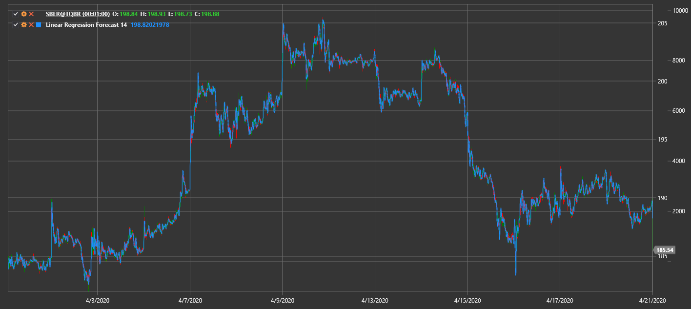

# Прогноз линейной регрессии

**Прогноз линейной регрессии (LRF)** строит прогноз цены на основе линейной регрессии за выбранный период.

Для использования индикатора необходимо использовать класс [LinearRegressionForecast](xref:StockSharp.Algo.Indicators.LinearRegressionForecast).

## См. также

[Linear Regression](lrc.md)
