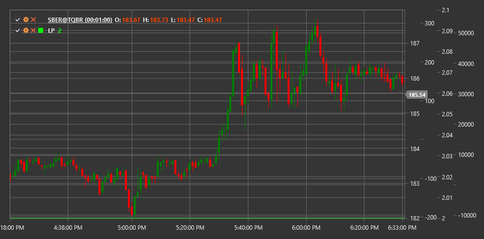

# LP

**Индикатор лунной фазы (Lunar Phase, LP)** - это нестандартный технический индикатор, который основывается на астрономических данных о фазах Луны для анализа потенциального влияния лунных циклов на финансовые рынки.

Для использования индикатора необходимо использовать класс [LunarPhase](xref:StockSharp.Algo.Indicators.LunarPhase).

## Описание

Индикатор лунной фазы (LP) представляет собой необычный инструмент технического анализа, который использует информацию о текущей фазе Луны для потенциального прогнозирования рыночных тенденций. Индикатор основан на теории, что лунные циклы могут оказывать определенное влияние на поведение участников рынка и, как следствие, на движение цен финансовых инструментов.

Лунный цикл длится приблизительно 29.53 дня и традиционно делится на четыре основные фазы:
1. Новолуние
2. Первая четверть (растущая Луна)
3. Полнолуние
4. Последняя четверть (убывающая Луна)

Индикатор отслеживает текущую фазу Луны и представляет эту информацию в виде числового значения от 0 до 1, где:
- 0 соответствует новолунию
- 0.25 соответствует первой четверти
- 0.5 соответствует полнолунию
- 0.75 соответствует последней четверти

## Расчет

Расчет индикатора лунной фазы основан на астрономических алгоритмах для определения текущей фазы Луны:

1. Определение количества дней, прошедших с начала лунного цикла (новолуния):
   ```
   Текущее_положение_в_цикле = (Текущая_дата - Дата_последнего_новолуния) % 29.53
   ```

2. Преобразование этого значения в фазу от 0 до 1:
   ```
   Фаза_Луны = Текущее_положение_в_цикле / 29.53
   ```

Полученное значение и является индикатором лунной фазы (LP).

## Интерпретация

Интерпретация индикатора лунной фазы может варьироваться, так как это нетрадиционный инструмент технического анализа. Однако существуют некоторые общепринятые подходы:

1. **Потенциальные точки разворота**:
   - Некоторые трейдеры считают, что новолуние и полнолуние могут совпадать с точками разворота на рынке
   - Переходы между основными фазами также могут рассматриваться как потенциальные периоды повышенной волатильности

2. **Циклы настроения рынка**:
   - Существует теория, что фазы Луны могут влиять на психологию масс и, следовательно, на настроение рынка
   - Некоторые исследования предполагают, что период полнолуния может приводить к более эмоциональному и иррациональному поведению трейдеров

3. **Корреляция с волатильностью**:
   - Некоторые исследования показывают, что волатильность может быть выше в периоды полнолуния и новолуния
   - Это может использоваться при настройке параметров других индикаторов и стратегий

4. **Сезонные паттерны**:
   - LP может использоваться в сочетании с анализом сезонных паттернов для выявления потенциальных периодичностей на рынке

5. **Фильтрация сигналов**:
   - Некоторые трейдеры используют LP как дополнительный фильтр для своих торговых стратегий
   - Например, они могут избегать определенных типов сделок во время конкретных лунных фаз, если историческая статистика показывает их низкую эффективность

6. **Комбинирование с другими индикаторами**:
   - LP обычно не используется как самостоятельный инструмент для принятия торговых решений
   - Его рекомендуется комбинировать с традиционными техническими индикаторами для подтверждения сигналов

Важно отметить, что научных доказательств прямого влияния фаз Луны на финансовые рынки недостаточно, и многие профессиональные трейдеры относятся к таким инструментам скептически. Однако некоторые участники рынка находят ценность в включении LP в свой аналитический арсенал.



## См. также

[SineWave](sine_wave.md)
[CyclePeriod](cycle_period.md)
[SeasonalAnalysis](seasonal_analysis.md)
[HarmonicOscillator](harmonic_oscillator.md)