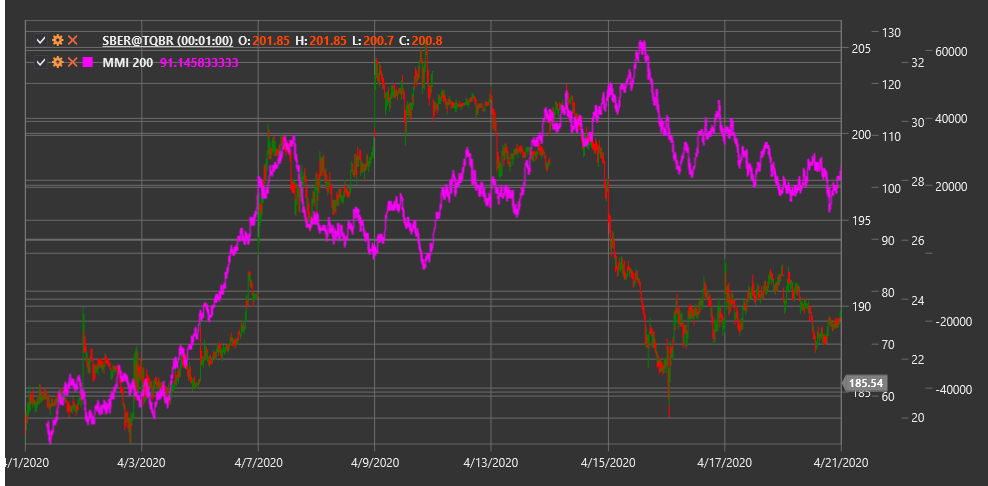

# MMI

**Индекс злобы рынка (Market Meanness Index, MMI)** - это технический индикатор, разработанный для определения, находится ли рынок в трендовом или боковом (хаотичном) состоянии.

Для использования индикатора необходимо использовать класс [MarketMeannessIndex](xref:StockSharp.Algo.Indicators.MarketMeannessIndex).

## Описание

Индекс злобы рынка (MMI) представляет собой инструмент, который помогает трейдерам определить характер текущего рынка - является ли он трендовым или боковым. Название "Meanness" (злоба) отражает идею, что рынок иногда ведет себя "злобно" или непредсказуемо по отношению к трейдерам, особенно когда находится в боковом движении.

MMI основан на подсчете количества пар ценовых значений (обычно цен закрытия), которые не следуют простому линейному шаблону, и их соотношения к общему количеству проанализированных пар. Индикатор измеряет "хаотичность" или "случайность" движения цены в определенный период.

Индекс колеблется от 0 до 100:
- Низкие значения (обычно ниже 50) указывают на преобладание трендового движения
- Высокие значения (обычно выше 50) указывают на преобладание бокового или хаотичного движения

## Параметры

Индикатор имеет следующие параметры:
- **Length** - период расчета (стандартное значение: 20)

## Расчет

Расчет Индекса злобы рынка включает следующие этапы:

1. Создание множества пар последовательных цен закрытия (Close) в заданном периоде Length.

2. Подсчет количества "непоследовательных" пар. Пара считается непоследовательной, если она не следует линейному шаблону, характерному для тренда. Если две последовательные пары (P1, P2) и (P2, P3) имеют противоположные направления (разные знаки разности), пара считается непоследовательной.

3. Расчет MMI как процентного соотношения:
   ```
   MMI = (Количество непоследовательных пар / Общее количество пар) * 100
   ```

Формально это можно представить так:
1. Для каждой тройки последовательных цен (Close[i-2], Close[i-1], Close[i]) проверяем:
   - Если (Close[i-1] - Close[i-2]) * (Close[i] - Close[i-1]) < 0, то пара считается непоследовательной
   - Подсчитываем общее количество таких пар

2. MMI = (Количество непоследовательных пар / (Length - 2)) * 100

## Интерпретация

Индекс злобы рынка можно интерпретировать следующим образом:

1. **Уровни индикатора**:
   - MMI > 50: Рынок находится в боковом или хаотичном состоянии
   - MMI < 50: Рынок находится в трендовом состоянии
   - Чем ближе MMI к 100, тем более хаотичным является рынок
   - Чем ближе MMI к 0, тем более выражен тренд

2. **Применение для торговых стратегий**:
   - Когда MMI высокий (>50), рекомендуется использовать стратегии, ориентированные на боковой рынок (например, торговля в диапазоне, осцилляторы)
   - Когда MMI низкий (<50), рекомендуется использовать трендовые стратегии (например, следование за трендом)

3. **Динамика изменений**:
   - Снижение MMI с высоких уровней может сигнализировать о формировании нового тренда
   - Повышение MMI с низких уровней может указывать на завершение тренда и переход к консолидации

4. **Экстремальные значения**:
   - Очень низкие значения (MMI < 20) могут указывать на сильный тренд, но также потенциальную перекупленность/перепроданность
   - Очень высокие значения (MMI > 80) указывают на крайне хаотичный рынок, где сложно применять любые стратегии

5. **Фильтрация сигналов**:
   - MMI часто используется как фильтр для других индикаторов:
     - Сигналы трендовых индикаторов (MA, MACD) более надежны при низком MMI
     - Сигналы осцилляторов (RSI, Stochastic) более надежны при высоком MMI

6. **Комбинирование с другими индикаторами**:
   - MMI хорошо работает в сочетании с ADX (Average Directional Index)
   - Низкий MMI и высокий ADX подтверждают сильный тренд
   - Высокий MMI и низкий ADX подтверждают боковой рынок

7. **Временные рамки**:
   - MMI может использоваться на разных временных рамках для определения характера рынка
   - Долгосрочный MMI помогает определить основное состояние рынка
   - Краткосрочный MMI помогает выбрать подходящую стратегию для текущих условий



## См. также

[ChoppinessIndex](choppiness_index.md)
[ADX](adx.md)
[VHF](vhf.md)
[BalanceOfPower](balance_of_power.md)