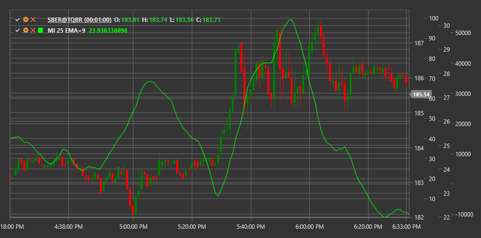

# MI

**Индекс массы (Mass Index, MI)** - это технический индикатор, разработанный Дональдом Дорси, который идентифицирует потенциальные развороты тренда, анализируя расширение и сжатие диапазона цен.

Для использования индикатора необходимо использовать класс [MassIndex](xref:StockSharp.Algo.Indicators.MassIndex).

## Описание

Индекс массы (MI) - это инструмент технического анализа, который помогает обнаруживать потенциальные развороты тренда путем отслеживания изменений в ценовом диапазоне (разница между максимальной и минимальной ценами). Индикатор был разработан Дональдом Дорси на основе предположения, что перед разворотом тренда обычно наблюдается расширение и последующее сжатие ценового диапазона.

MI измеряет волатильность с помощью экспоненциальных скользящих средних (EMA) ценового диапазона. Он не предсказывает направление разворота, а только указывает на его вероятность. Именно поэтому MI часто используется вместе с другими индикаторами направления.

Основная концепция заключается в том, что когда индекс массы достигает определенного порогового значения, а затем падает ниже этого уровня, повышается вероятность разворота текущего тренда.

## Параметры

Индикатор имеет следующие параметры:
- **Length** - основной период для расчета (стандартное значение: 25)
- **EmaLength** - период для EMA диапазона цен (стандартное значение: 9)

## Расчет

Расчет Индекса массы включает следующие этапы:

1. Расчет диапазона High-Low для каждого периода:
   ```
   Range = High - Low
   ```

2. Расчет 9-периодной EMA диапазона:
   ```
   EMA1 = EMA(Range, EmaLength)
   ```

3. Расчет 9-периодной EMA от EMA диапазона:
   ```
   EMA2 = EMA(EMA1, EmaLength)
   ```

4. Расчет соотношения:
   ```
   Ratio = EMA1 / EMA2
   ```

5. Суммирование соотношений за 25 периодов:
   ```
   MI = Сумма(Ratio за последние Length периодов)
   ```

где:
- High - максимальная цена периода
- Low - минимальная цена периода
- EMA - экспоненциальное скользящее среднее
- Length - период суммирования (обычно 25)
- EmaLength - период для EMA (обычно 9)

## Интерпретация

Индекс массы интерпретируется следующим образом:

1. **"Горбатая реверсия"**:
   - Классический сигнал "горбатой реверсии" формируется, когда индекс массы поднимается выше 27, а затем опускается ниже 26.5
   - Этот паттерн указывает на возможный разворот текущего тренда, хотя не предсказывает его направление

2. **Уровни индекса**:
   - Значения выше 27 указывают на расширение диапазона цен и повышенную волатильность
   - Высокие значения, за которыми следует снижение, могут предшествовать развороту тренда
   - Низкие значения (ниже 20) указывают на сужение диапазона цен и пониженную волатильность

3. **Направление тренда**:
   - Индекс массы не указывает направление тренда или его разворота
   - Для определения направления необходимо использовать дополнительные индикаторы или методы анализа (например, скользящие средние или уровни поддержки/сопротивления)

4. **Дивергенции**:
   - Дивергенции между ценой и индексом массы менее значимы, чем паттерн "горбатой реверсии"
   - Однако расхождение между новыми максимумами/минимумами цены и снижающимися максимумами/минимумами индекса может указывать на ослабление тренда

5. **Комбинирование с другими индикаторами**:
   - Индекс массы лучше всего использовать в сочетании с индикаторами направления тренда
   - Популярные комбинации включают EMA, MACD или RSI для определения направления потенциального разворота

6. **Изменение волатильности**:
   - Резкое увеличение индекса массы указывает на значительное расширение диапазона цен, что может предшествовать сильному движению
   - Постепенное снижение индекса указывает на сужение диапазона и возможную консолидацию

7. **Настройка параметров**:
   - Стандартные параметры (9 для EMA, 25 для суммирования) работают хорошо на большинстве таймфреймов
   - Для более быстрых сигналов можно уменьшить периоды, но это может привести к увеличению ложных сигналов



## См. также

[ATR](atr.md)
[BollingerBands](bollinger_bands.md)
[ChoppinessIndex](choppiness_index.md)
[TrueRange](true_range.md)