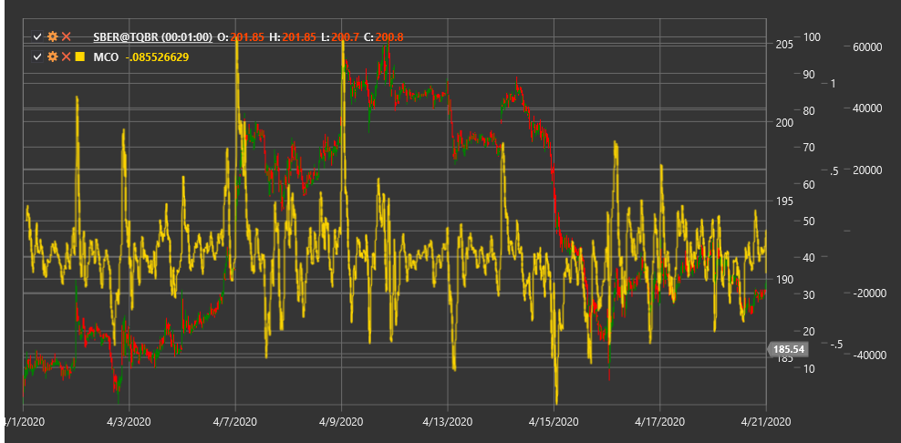

# MCO

**Осциллятор Макклеллана (McClellan Oscillator, MCO)** - это технический индикатор, разработанный Шерманом и Мэриан Макклеллан, который измеряет рыночную широту путем анализа разницы между скользящими средними возрастающих и снижающихся акций.

Для использования индикатора необходимо использовать класс [McClellanOscillator](xref:StockSharp.Algo.Indicators.McClellanOscillator).

## Описание

Осциллятор Макклеллана (MCO) является одним из наиболее известных индикаторов рыночной широты, который помогает оценить общее состояние рынка и определить потенциальные точки разворота. Он был разработан в 1969 году и с тех пор стал важным инструментом для многих технических аналитиков.

MCO основан на анализе соотношения между количеством растущих и падающих акций на рынке. Для расчета индикатора используется разница между 19-периодной и 39-периодной экспоненциальными скользящими средними от чистого продвижения (разница между количеством растущих и падающих акций).

Осциллятор Макклеллана особенно полезен для:
- Определения общего направления рынка
- Выявления перекупленных и перепроданных условий
- Идентификации потенциальных точек разворота
- Подтверждения силы или слабости текущего тренда

## Расчет

Расчет Осциллятора Макклеллана включает следующие этапы:

1. Вычисление чистого продвижения (Net Advances) для каждого торгового дня:
   ```
   Net Advances = Advances - Declines
   ```
   где Advances - количество растущих акций, Declines - количество падающих акций.

2. Расчет 19-периодной экспоненциальной скользящей средней от Net Advances:
   ```
   EMA19 = EMA(Net Advances, 19)
   ```

3. Расчет 39-периодной экспоненциальной скользящей средней от Net Advances:
   ```
   EMA39 = EMA(Net Advances, 39)
   ```

4. Вычисление Осциллятора Макклеллана как разницы между этими двумя EMA:
   ```
   MCO = EMA19 - EMA39
   ```

## Интерпретация

Осциллятор Макклеллана можно интерпретировать следующим образом:

1. **Пересечение нулевой линии**:
   - Пересечение MCO нулевой линии снизу вверх может рассматриваться как бычий сигнал, указывающий на потенциальное начало восходящего тренда
   - Пересечение MCO нулевой линии сверху вниз может рассматриваться как медвежий сигнал, указывающий на потенциальное начало нисходящего тренда

2. **Экстремальные значения**:
   - Значения выше +100 часто указывают на перекупленность рынка
   - Значения ниже -100 часто указывают на перепроданность рынка
   - Экстремальные значения (+150/-150 и выше/ниже) могут сигнализировать о потенциальном развороте рынка

3. **Дивергенции**:
   - Бычья дивергенция: индекс формирует новый минимум, а MCO - более высокий минимум
   - Медвежья дивергенция: индекс формирует новый максимум, а MCO - более низкий максимум

4. **Состояние рыночной широты**:
   - Положительные значения MCO указывают на то, что большинство акций на рынке растут
   - Отрицательные значения MCO указывают на то, что большинство акций на рынке падают

5. **Ускорение/замедление движения**:
   - Увеличение значений MCO (положительных или отрицательных) указывает на ускорение текущего движения рынка
   - Уменьшение значений MCO указывает на замедление текущего движения рынка

6. **Комбинирование с McClellan Summation Index**:
   - McClellan Summation Index (MSI) - это кумулятивная сумма значений MCO
   - Пересечение MSI с нуля может подтверждать сигналы MCO и указывать на долгосрочные изменения тренда

7. **Бычьи/медвежьи паттерны**:
   - "Бычий хвост" - быстрое падение MCO с последующим быстрым восстановлением, часто указывает на потенциальное дно рынка
   - "Медвежий хвост" - быстрый рост MCO с последующим быстрым падением, часто указывает на потенциальную вершину рынка



## См. также

[HighLowIndex](high_low_index.md)