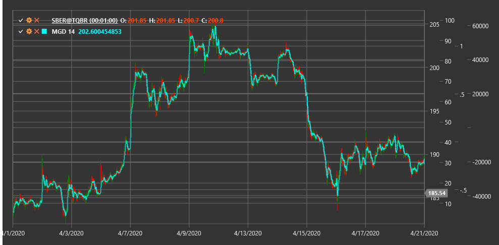

# MGD

**Динамическая McGinley (McGinley Dynamic, MGD)** - это технический индикатор, разработанный Джоном Р. МакГинли, который представляет собой усовершенствованную форму скользящей средней, автоматически корректирующую свою скорость на основе изменений в рыночной скорости.

Для использования индикатора необходимо использовать класс [McGinleyDynamic](xref:StockSharp.Algo.Indicators.McGinleyDynamic).

## Описание

Динамическая McGinley (MGD) была создана Джоном МакГинли для преодоления некоторых недостатков традиционных скользящих средних, таких как запаздывание и неспособность адаптироваться к изменениям в скорости рынка. Индикатор автоматически корректирует свой период реакции в зависимости от скорости движения цены, что делает его более чувствительным к быстрым изменениям и менее подверженным ложным сигналам.

В отличие от простых и экспоненциальных скользящих средних, MGD включает в свою формулу константу настройки и отношение цены к предыдущему значению индикатора. Это позволяет MGD быстрее реагировать на значительные изменения цены, сохраняя при этом стабильность при более медленных движениях.

Основная идея заключается в том, что MGD "ускоряется" во время быстрых движений рынка и "замедляется" во время периодов консолидации, обеспечивая более точное отслеживание цены, чем традиционные скользящие средние.

## Параметры

Индикатор имеет следующие параметры:
- **Length** - период расчета (стандартное значение: 14)

## Расчет

Расчет Динамической McGinley выполняется рекурсивно с использованием следующей формулы:

```
MGD = MGD[предыдущий] + (Price - MGD[предыдущий]) / (Length * ((Price / MGD[предыдущий])^4))
```

где:
- Price - текущая цена (обычно цена закрытия)
- MGD[предыдущий] - предыдущее значение индикатора
- Length - параметр периода

Для первоначального значения MGD обычно используется простое скользящее среднее за указанный период:

```
Для первого расчета: MGD = SMA(Price, Length)
```

## Интерпретация

Динамическую McGinley можно интерпретировать аналогично другим скользящим средним, но с учетом ее улучшенных характеристик:

1. **Определение тренда**:
   - Когда цена находится выше MGD, это указывает на восходящий тренд
   - Когда цена находится ниже MGD, это указывает на нисходящий тренд
   - Крутой угол наклона MGD указывает на сильный тренд

2. **Пересечения с ценой**:
   - Пересечение цены с MGD снизу вверх может рассматриваться как бычий сигнал
   - Пересечение цены с MGD сверху вниз может рассматриваться как медвежий сигнал
   - Из-за адаптивной природы MGD, эти пересечения обычно формируются раньше, чем с традиционными скользящими средними

3. **Пересечения нескольких MGD**:
   - Можно использовать несколько MGD с разными периодами (например, MGD(14) и MGD(30))
   - Пересечение короткой MGD с длинной MGD снизу вверх может рассматриваться как подтверждение бычьего тренда
   - Пересечение короткой MGD с длинной MGD сверху вниз может рассматриваться как подтверждение медвежьего тренда

4. **Уровни поддержки и сопротивления**:
   - MGD часто служит динамическим уровнем поддержки в восходящем тренде
   - MGD часто служит динамическим уровнем сопротивления в нисходящем тренде
   - Многократные отскоки от MGD подтверждают силу тренда

5. **Соотношение с ценой**:
   - Расстояние между ценой и MGD может указывать на перекупленность или перепроданность рынка
   - Когда цена значительно удаляется от MGD, это может сигнализировать о потенциальном развороте или коррекции

6. **Комбинирование с другими индикаторами**:
   - MGD хорошо работает в сочетании с осцилляторами (RSI, Stochastic)
   - Можно использовать MGD в качестве тренд-фильтра для других торговых систем

7. **Выбор параметра Length**:
   - Меньшие значения Length (например, 8-12) делают MGD более чувствительным к изменениям цены и подходят для краткосрочной торговли
   - Большие значения Length (например, 20-50) делают MGD более сглаженным и подходят для долгосрочной торговли



## См. также

[SMA](sma.md)
[EMA](ema.md)
[DEMA](dema.md)
[HMA](hma.md)