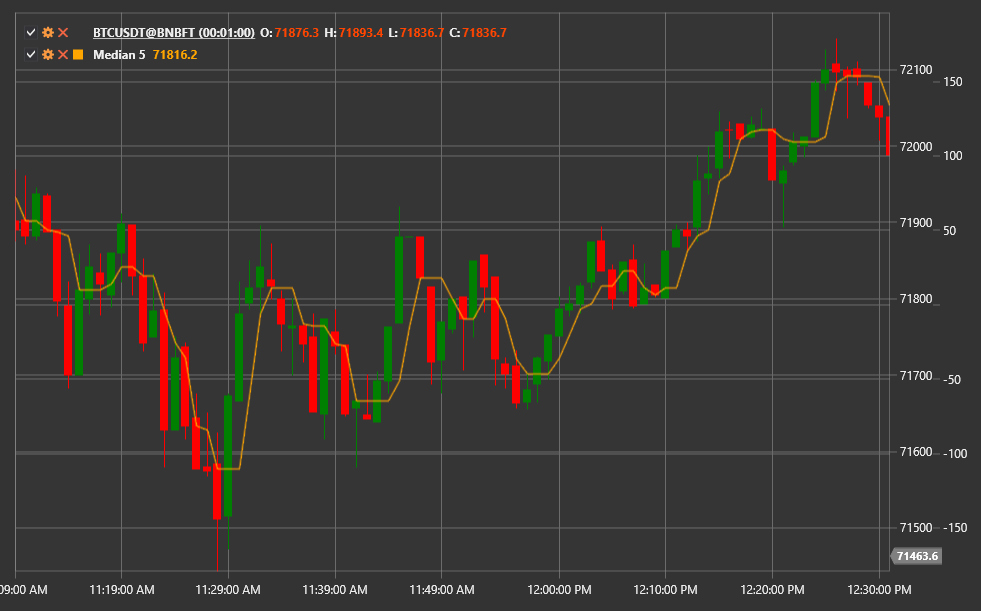

# Moving Median

**Moving Median** — индикатор сглаживания, который вычисляет медиану последних N значений. В отличие от скользящих средних, медиана
не реагирует на выбросы и сохраняет резкие изменения цены, что делает её полезной в условиях шумного рынка.

Для использования индикатора необходимо применять класс [Median](xref:StockSharp.Algo.Indicators.Median).

## Описание

Медианная фильтрация предполагает сортировку цен в скользящем окне и выбор центрального значения. Благодаря этому:

- единичные всплески или провалы цены не влияют на итог;
- задержка между ценой и индикатором меньше, чем у большинства сглаживающих фильтров;
- форма сигнала остаётся более «угловатой», что помогает вовремя фиксировать развороты.

## Параметры

- **Length** — размер окна, по которому рассчитывается медиана. Чем больше окно, тем сильнее сглаживание и тем больше задержка.

## Использование

- Moving Median может использоваться как альтернатива скользящим средним при работе с шумными данными.
- Пересечения цены и медианы служат сигналами о смене направления.
- В комбинации с другими фильтрами медиана помогает выделять тренд, сохраняя при этом важные ценовые всплески.

## См. также

[SMA](sma.md)
[EMA](ema.md)
[Smoothed Moving Average](smoothed_ma.md)
