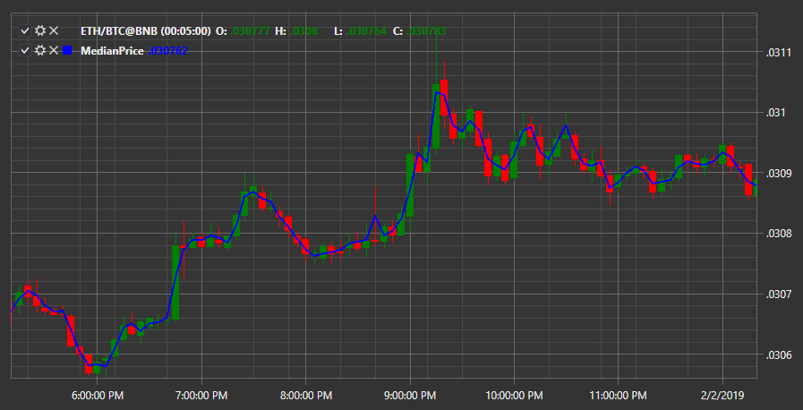

# Медианная цена

Индикатор **Медианная цена** показывает медианную цену для свечи.

Для использования индикатора необходимо использовать класс [MedianPrice](xref:StockSharp.Algo.Indicators.MedianPrice).

## См. также

[Momentum](momentum.md)
