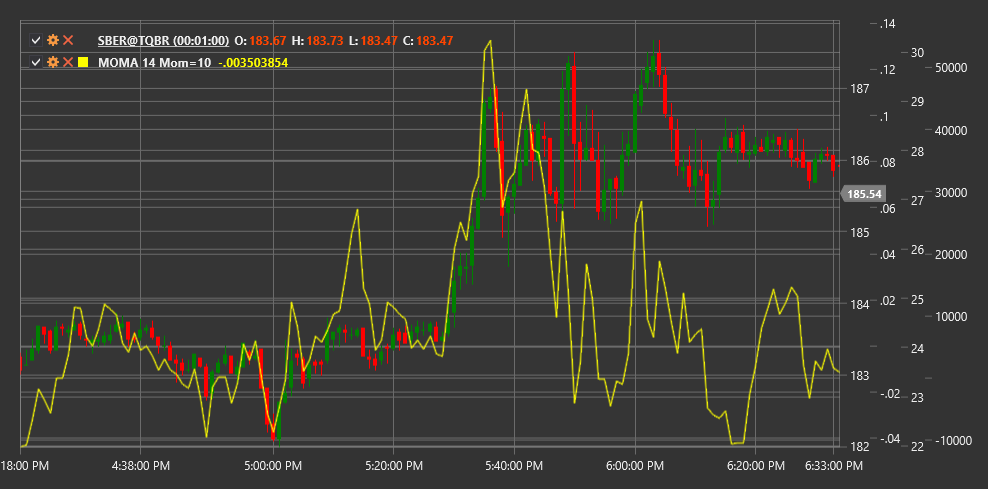

# MOMA

**Импульс скользящей средней (Momentum of Moving Average, MOMA)** - это технический индикатор, который измеряет скорость изменения скользящей средней цены, объединяя концепции импульса и скользящих средних.

Для использования индикатора необходимо использовать класс [MomentumOfMovingAverage](xref:StockSharp.Algo.Indicators.MomentumOfMovingAverage).

## Описание

Импульс скользящей средней (MOMA) представляет собой комбинацию двух индикаторов - индикатора импульса и скользящей средней. Сначала рассчитывается скользящая средняя ценового ряда, а затем измеряется импульс (скорость изменения) этой скользящей средней.

Основная идея MOMA заключается в том, чтобы сначала сгладить ценовой ряд с помощью скользящей средней, убрав таким образом рыночный шум, а затем проанализировать скорость и направление изменения этой сглаженной кривой. Это позволяет получить более чистый сигнал об изменении импульса тренда, чем при расчете импульса непосредственно от цены.

MOMA помогает определить силу тренда и потенциальные точки разворота, фокусируясь на изменениях в динамике скользящей средней, а не самой цены. Положительные значения MOMA указывают на восходящий импульс скользящей средней, а отрицательные - на нисходящий.

## Параметры

Индикатор имеет следующие параметры:
- **Length** - период для расчета скользящей средней (стандартное значение: 14)
- **MomentumPeriod** - период для расчета импульса (стандартное значение: 10)

## Расчет

Расчет Импульса скользящей средней включает следующие этапы:

1. Расчет скользящей средней для ценового ряда:
   ```
   MA = SMA(Price, Length)
   ```

2. Расчет импульса скользящей средней:
   ```
   MOMA = MA[текущий] - MA[текущий - MomentumPeriod]
   ```

где:
- Price - цена (обычно цена закрытия)
- SMA - простое скользящее среднее
- Length - период для скользящей средней
- MomentumPeriod - период для расчета импульса

Примечание: Вместо SMA могут использоваться и другие типы скользящих средних, такие как EMA (экспоненциальное скользящее среднее), WMA (взвешенное скользящее среднее) и т.д.

## Интерпретация

Импульс скользящей средней можно интерпретировать следующим образом:

1. **Пересечение нулевой линии**:
   - Пересечение MOMA нулевой линии снизу вверх может рассматриваться как бычий сигнал, указывающий на начало или усиление восходящего тренда
   - Пересечение MOMA нулевой линии сверху вниз может рассматриваться как медвежий сигнал, указывающий на начало или усиление нисходящего тренда

2. **Абсолютные значения**:
   - Высокие положительные значения MOMA указывают на сильный восходящий импульс скользящей средней
   - Высокие отрицательные значения MOMA указывают на сильный нисходящий импульс скользящей средней
   - Значения, близкие к нулю, указывают на отсутствие выраженного импульса или боковой тренд

3. **Дивергенции**:
   - Бычья дивергенция: цена формирует новый минимум, а MOMA - более высокий минимум
   - Медвежья дивергенция: цена формирует новый максимум, а MOMA - более низкий максимум

4. **Изменение направления**:
   - Когда MOMA меняет направление движения (с роста на падение или наоборот), это может сигнализировать о потенциальном изменении в тренде скользящей средней
   - Такие развороты часто предшествуют изменениям в направлении цены

5. **Подтверждение тренда**:
   - Положительные значения MOMA подтверждают восходящий тренд
   - Отрицательные значения MOMA подтверждают нисходящий тренд
   - Увеличение значений MOMA указывает на усиление текущего тренда
   - Уменьшение значений MOMA указывает на ослабление текущего тренда

6. **Фильтрация сигналов**:
   - MOMA может использоваться для фильтрации сигналов других индикаторов
   - Например, можно рассматривать только бычьи сигналы, когда MOMA положительный, и только медвежьи, когда MOMA отрицательный

7. **Выбор параметров**:
   - Более короткие периоды для Length и MomentumPeriod делают MOMA более чувствительным, но и более подверженным ложным сигналам
   - Более длинные периоды делают MOMA более сглаженным, но могут приводить к запаздыванию сигналов



## См. также

[Momentum](momentum.md)
[SMA](sma.md)
[EMA](ema.md)
[ROC](roc.md)