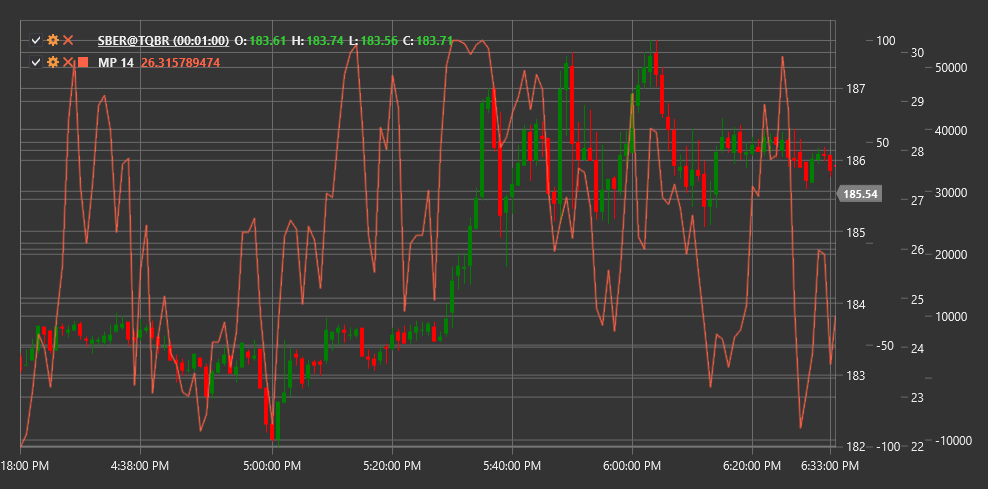

# MP

**Индикатор импульса пинбола (Momentum Pinball, MP)** - это технический индикатор, который анализирует импульс цены и его изменения для определения потенциальных точек разворота и силы тренда на рынке.

Для использования индикатора необходимо использовать класс [MomentumPinball](xref:StockSharp.Algo.Indicators.MomentumPinball).

## Описание

Индикатор импульса пинбола (MP) - это специализированный осциллятор, разработанный для отслеживания импульса цены и выявления потенциальных точек разворота. Название "пинбол" отражает способность индикатора идентифицировать моменты, когда цена, подобно шарику в пинболе, отскакивает от крайних положений.

MP анализирует отношение текущего импульса к его историческим экстремумам и определяет, когда рынок достигает состояния перекупленности или перепроданности. Индикатор также помогает определить моменты, когда импульс начинает ослабевать, что может предшествовать развороту тренда.

Основная идея заключается в том, что экстремальные значения импульса часто не устойчивы, и после достижения таких экстремумов обычно следует коррекция или разворот. MP помогает визуализировать этот процесс, отслеживая как сам импульс, так и его изменения.

## Параметры

Индикатор имеет следующие параметры:
- **Length** - период расчета (стандартное значение: 14)

## Расчет

Расчет Индикатора импульса пинбола включает следующие этапы:

1. Расчет базового импульса как разницы между текущей ценой и ценой N периодов назад:
   ```
   Momentum = Price[текущий] - Price[текущий - Length]
   ```

2. Определение исторического максимума и минимума импульса за установленный период:
   ```
   Max_Momentum = Maximum(Momentum) за период Length
   Min_Momentum = Minimum(Momentum) за период Length
   ```

3. Нормализация текущего значения импульса относительно исторических экстремумов:
   ```
   Normalized_Momentum = (Momentum - Min_Momentum) / (Max_Momentum - Min_Momentum)
   ```

4. Расчет скорости изменения нормализованного импульса:
   ```
   Momentum_Change = Normalized_Momentum[текущий] - Normalized_Momentum[текущий - 1]
   ```

5. Итоговый расчет MP как комбинации нормализованного импульса и его изменения:
   ```
   MP = Normalized_Momentum + Momentum_Change
   ```

где:
- Price - цена (обычно цена закрытия)
- Length - период расчета
- Momentum - базовый импульс
- Normalized_Momentum - нормализованный импульс
- Momentum_Change - изменение импульса

## Интерпретация

Индикатор импульса пинбола можно интерпретировать следующим образом:

1. **Уровни экстремумов**:
   - Значения выше 0.8 указывают на перекупленность рынка
   - Значения ниже 0.2 указывают на перепроданность рынка
   - Когда MP достигает этих уровней, повышается вероятность разворота или коррекции

2. **Дивергенции**:
   - Бычья дивергенция: цена формирует новый минимум, а MP - более высокий минимум
   - Медвежья дивергенция: цена формирует новый максимум, а MP - более низкий максимум
   - Дивергенции часто предшествуют значительным разворотам тренда

3. **Пересечение центральной линии**:
   - Пересечение MP уровня 0.5 снизу вверх может рассматриваться как бычий сигнал
   - Пересечение MP уровня 0.5 сверху вниз может рассматриваться как медвежий сигнал

4. **Отскоки от экстремумов**:
   - Разворот MP от уровней перекупленности или перепроданности может генерировать сигналы для входа в рынок
   - Особенно сильные сигналы формируются, когда такие развороты сопровождаются дивергенциями

5. **Анализ тренда**:
   - Устойчивые значения MP выше 0.5 подтверждают восходящий тренд
   - Устойчивые значения MP ниже 0.5 подтверждают нисходящий тренд
   - Колебания MP вокруг уровня 0.5 указывают на боковой тренд или неопределенность

6. **Сила импульса**:
   - Крутой угол наклона MP указывает на сильный импульс
   - Пологий угол наклона MP указывает на слабый импульс
   - Замедление роста или падения MP может предшествовать развороту тренда

7. **Комбинирование с другими индикаторами**:
   - MP часто используется в сочетании с трендовыми индикаторами
   - Например, можно использовать скользящие средние для определения направления тренда, а MP - для выбора точек входа и выхода



## См. также

[Momentum](momentum.md)
[RSI](rsi.md)
[StochasticOscillator](stochastic_oscillator.md)
[PrettyGoodOscillator](pretty_good_oscillator.md)