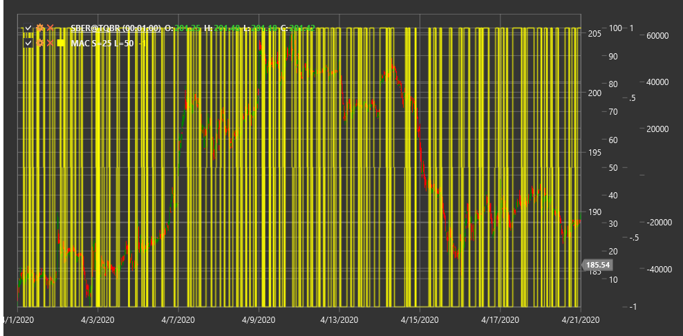

# MAC

**Пересечение скользящих средних (Moving Average Crossover, MAC)** - это технический индикатор, который отслеживает пересечения между короткой и длинной скользящими средними для определения потенциальных точек входа и выхода с рынка.

Для использования индикатора необходимо использовать класс [MovingAverageCrossover](xref:StockSharp.Algo.Indicators.MovingAverageCrossover).

## Описание

Индикатор пересечения скользящих средних (MAC) является одним из наиболее широко используемых и простых для понимания индикаторов в техническом анализе. Он основан на концепции, что когда краткосрочная скользящая средняя пересекает долгосрочную скользящую среднюю, это может сигнализировать о смене тренда или значительном движении цены.

MAC использует две скользящие средние с разными периодами:
1. Короткая скользящая средняя (FastMA) - отражает недавнее движение цены
2. Длинная скользящая средняя (SlowMA) - отражает более долгосрочное движение цены

Индикатор обычно представляется в виде разницы между короткой и длинной скользящими средними, что позволяет легко определить момент пересечения (когда значение индикатора пересекает нулевую линию).

MAC широко используется как в самостоятельных торговых стратегиях, так и в составе более сложных систем, таких как MACD (Moving Average Convergence Divergence).

## Параметры

Индикатор имеет следующие параметры:
- **ShortPeriod** - период для короткой скользящей средней (стандартное значение: 9)
- **LongPeriod** - период для длинной скользящей средней (стандартное значение: 26)

## Расчет

Расчет индикатора пересечения скользящих средних включает следующие этапы:

1. Расчет короткой скользящей средней:
   ```
   FastMA = SMA(Price, ShortPeriod)
   ```

2. Расчет длинной скользящей средней:
   ```
   SlowMA = SMA(Price, LongPeriod)
   ```

3. Расчет значения MAC как разницы между короткой и длинной скользящими средними:
   ```
   MAC = FastMA - SlowMA
   ```

где:
- Price - цена (обычно цена закрытия)
- SMA - простое скользящее среднее
- ShortPeriod - период для короткой скользящей средней
- LongPeriod - период для длинной скользящей средней

Примечание: Вместо SMA могут использоваться и другие типы скользящих средних, такие как EMA (экспоненциальное скользящее среднее), WMA (взвешенное скользящее среднее) и т.д.

## Интерпретация

Индикатор пересечения скользящих средних можно интерпретировать следующим образом:

1. **Пересечение нулевой линии**:
   - Пересечение MAC нулевой линии снизу вверх (FastMA пересекает SlowMA снизу вверх) генерирует бычий сигнал, указывающий на потенциальное начало восходящего тренда
   - Пересечение MAC нулевой линии сверху вниз (FastMA пересекает SlowMA сверху вниз) генерирует медвежий сигнал, указывающий на потенциальное начало нисходящего тренда

2. **Значение индикатора**:
   - Положительное значение MAC указывает на то, что короткая скользящая средняя находится выше длинной, что часто интерпретируется как бычье состояние рынка
   - Отрицательное значение MAC указывает на то, что короткая скользящая средняя находится ниже длинной, что часто интерпретируется как медвежье состояние рынка

3. **Расстояние между скользящими средними**:
   - Увеличение расстояния между скользящими средними (увеличение абсолютного значения MAC) указывает на усиление текущего тренда
   - Уменьшение расстояния между скользящими средними (уменьшение абсолютного значения MAC) может указывать на ослабление тренда и потенциальный разворот

4. **Ложные сигналы**:
   - В периоды боковой консолидации MAC может генерировать множество ложных сигналов из-за частых пересечений скользящих средних
   - Для фильтрации ложных сигналов часто используют дополнительные индикаторы или правила (например, требование, чтобы цена была выше/ниже обеих скользящих средних)

5. **Комбинирование с другими индикаторами**:
   - MAC часто используется в сочетании с индикаторами импульса (RSI, Stochastic) для подтверждения сигналов
   - Также его можно комбинировать с индикаторами тренда и волатильности для создания более комплексных торговых систем

6. **Выбор параметров**:
   - Более короткие периоды (например, 5 и 20) более чувствительны и подходят для краткосрочной торговли
   - Более длинные периоды (например, 50 и 200) менее чувствительны и подходят для долгосрочной торговли



## См. также

[SMA](sma.md)
[EMA](ema.md)
[MACD](macd.md)
[MovingAverageRibbon](moving_average_ribbon.md)