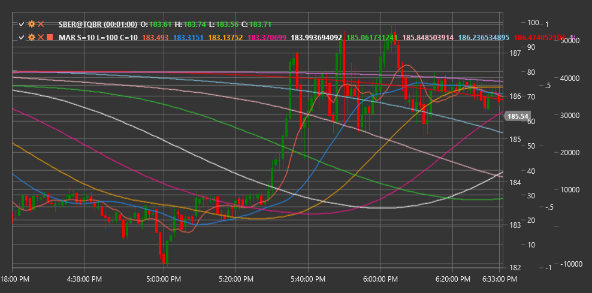

# MAR

**Лента скользящего среднего (Moving Average Ribbon, MAR)** - это технический индикатор, который отображает несколько скользящих средних с последовательно увеличивающимися периодами для визуализации силы и направления тренда.

Для использования индикатора необходимо использовать класс [MovingAverageRibbon](xref:StockSharp.Algo.Indicators.MovingAverageRibbon).

## Описание

Лента скользящего среднего (MAR) представляет собой набор из нескольких скользящих средних, расположенных на графике в виде "ленты" или "веера". Этот индикатор помогает трейдерам визуализировать текущее состояние тренда и его силу более наглядно, чем при использовании одной или двух скользящих средних.

MAR включает несколько скользящих средних (обычно от 5 до 10) с последовательно увеличивающимися периодами. Интервал между периодами может быть равномерным (например, 10, 20, 30, 40...) или экспоненциальным (например, 5, 10, 20, 40...).

Основная идея заключается в том, что взаимное расположение и форма этих скользящих средних может предоставить ценную информацию о состоянии и силе текущего тренда, а также помочь выявить потенциальные точки разворота.

## Параметры

Индикатор имеет следующие параметры:
- **ShortPeriod** - начальный (минимальный) период для скользящих средних (стандартное значение: 10)
- **LongPeriod** - конечный (максимальный) период для скользящих средних (стандартное значение: 100)
- **RibbonCount** - количество скользящих средних в ленте (стандартное значение: 10)

## Расчет

Расчет ленты скользящего среднего включает следующие этапы:

1. Определение последовательности периодов для скользящих средних:
   ```
   Step = (LongPeriod - ShortPeriod) / (RibbonCount - 1)
   Periods = [ShortPeriod, ShortPeriod + Step, ShortPeriod + 2*Step, ..., LongPeriod]
   ```

2. Расчет скользящей средней для каждого периода:
   ```
   MAs = [SMA(Price, Period) для каждого Period в Periods]
   ```

где:
- Price - цена (обычно цена закрытия)
- SMA - простое скользящее среднее
- ShortPeriod - начальный период
- LongPeriod - конечный период
- RibbonCount - количество скользящих средних

Примечание: Вместо SMA могут использоваться и другие типы скользящих средних, такие как EMA (экспоненциальное скользящее среднее), WMA (взвешенное скользящее среднее) и т.д.

## Интерпретация

Ленту скользящего среднего можно интерпретировать следующим образом:

1. **Взаимное расположение скользящих средних**:
   - Когда все линии расположены в порядке возрастания периодов (самая короткая сверху, самая длинная снизу), это указывает на сильный восходящий тренд
   - Когда все линии расположены в порядке убывания периодов (самая короткая снизу, самая длинная сверху), это указывает на сильный нисходящий тренд
   - Когда линии перекрещиваются и не имеют четкого порядка, это указывает на боковой тренд или неопределенность

2. **Форма ленты**:
   - Расширяющаяся лента (увеличение расстояния между линиями) указывает на усиление тренда
   - Сужающаяся лента (уменьшение расстояния между линиями) указывает на ослабление тренда
   - Плотная группировка линий указывает на консолидацию или отсутствие выраженного тренда

3. **Пересечения скользящих средних**:
   - Начало перекрещивания линий может сигнализировать о потенциальном изменении тренда
   - Когда короткие скользящие средние начинают пересекать длинные, это может быть ранним сигналом смены тренда

4. **Угол наклона ленты**:
   - Крутой угол наклона указывает на сильный тренд
   - Пологий угол наклона указывает на слабый тренд
   - Горизонтальное расположение ленты указывает на боковой тренд

5. **Положение цены относительно ленты**:
   - Когда цена находится выше всей ленты, это подтверждает сильный восходящий тренд
   - Когда цена находится ниже всей ленты, это подтверждает сильный нисходящий тренд
   - Когда цена движется внутри ленты, это может указывать на переходное состояние или консолидацию

6. **Торговые стратегии**:
   - Вход в позицию, когда цена отскакивает от края ленты в направлении тренда
   - Выход из позиции, когда скользящие средние начинают перекрещиваться в противоположном направлении
   - Использование ширины ленты для настройки стоп-лоссов и тейк-профитов



## См. также

[SMA](sma.md)
[EMA](ema.md)
[MovingAverageCrossover](moving_average_crossover.md)
[GuppyMultipleMovingAverage](guppy_multiple_moving_average.md)