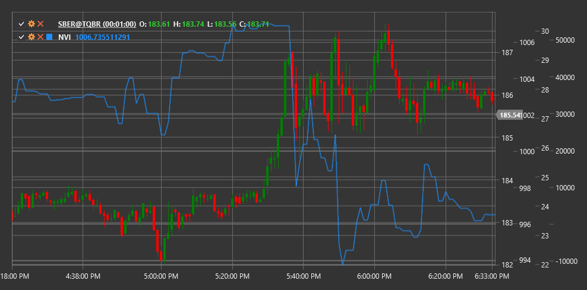

# NVI

**Индекс отрицательного объема (Negative Volume Index, NVI)** - это технический индикатор, разработанный Полом Дизом, который фокусируется на изменениях цены в дни, когда объем торгов снижается по сравнению с предыдущим днем.

Для использования индикатора необходимо использовать класс [NegativeVolumeIndex](xref:StockSharp.Algo.Indicators.NegativeVolumeIndex).

## Описание

Индекс отрицательного объема (NVI) основан на идее, что "умные деньги" активны в дни с низким объемом, в то время как "толпа" (непрофессиональные трейдеры) более активна в дни с высоким объемом. NVI изменяется только в те дни, когда текущий объем ниже, чем объем предыдущего дня.

Концепция индикатора предполагает, что движения цены на пониженном объеме более значимы и часто отражают действия информированных инвесторов. NVI стремится отследить эти движения, игнорируя ценовые изменения в дни с увеличенным объемом.

NVI часто используется вместе с дополнительным индикатором - Positive Volume Index (PVI), который, напротив, учитывает только те дни, когда объем растет.

## Расчет

Расчет Индекса отрицательного объема включает следующие этапы:

1. Установка начального значения NVI (обычно 1000):
   ```
   NVI[начальное] = 1000
   ```

2. Для каждого последующего периода:
   ```
   Если Volume[текущий] < Volume[предыдущий], то:
       NVI[текущий] = NVI[предыдущий] * (1 + (Price[текущий] - Price[предыдущий]) / Price[предыдущий])
   Иначе:
       NVI[текущий] = NVI[предыдущий]
   ```

где:
- Price - цена (обычно цена закрытия)
- Volume - объем торгов

Другими словами, NVI изменяется только в те дни, когда объем торгов снижается, и остается неизменным в дни с растущим или неизменным объемом.

## Интерпретация

Индекс отрицательного объема можно интерпретировать следующим образом:

1. **Трендовый анализ**:
   - Растущий NVI указывает на то, что "умные деньги" покупают, что может предвещать будущий рост цены
   - Падающий NVI указывает на то, что "умные деньги" продают, что может предвещать будущее падение цены

2. **Пересечение с скользящими средними**:
   - Часто NVI сравнивают с его 255-дневной скользящей средней (примерно один год торгов)
   - Когда NVI находится выше своей 255-дневной SMA, это считается бычьим сигналом
   - Когда NVI находится ниже своей 255-дневной SMA, это считается медвежьим сигналом

3. **Дивергенции**:
   - Бычья дивергенция: цена формирует новый минимум, а NVI - более высокий минимум
   - Медвежья дивергенция: цена формирует новый максимум, а NVI - более низкий максимум

4. **Комбинирование с PVI**:
   - Когда и NVI, и PVI растут, это сильный бычий сигнал
   - Когда и NVI, и PVI падают, это сильный медвежий сигнал
   - Когда NVI растет, а PVI падает, это может указывать на то, что "умные деньги" покупают, в то время как "толпа" продает (потенциально бычий сценарий)
   - Когда NVI падает, а PVI растет, это может указывать на то, что "умные деньги" продают, в то время как "толпа" покупает (потенциально медвежий сценарий)

5. **Долгосрочные изменения**:
   - NVI часто рассматривается как долгосрочный индикатор
   - Устойчивое изменение направления NVI может сигнализировать о значительном изменении рыночного настроения

6. **Подтверждение других индикаторов**:
   - NVI лучше всего использовать в сочетании с другими техническими индикаторами и методами анализа
   - Сигналы NVI становятся более надежными, когда они подтверждаются другими индикаторами

7. **Установка порогов**:
   - Некоторые трейдеры устанавливают пороговые уровни для NVI (например, 5% выше или ниже скользящей средней)
   - Преодоление этих порогов может рассматриваться как более сильный сигнал, чем простое пересечение



## См. также

[OBV](on_balance_volume.md)
[ADL](accumulation_distribution_line.md)
[ChaikinMoneyFlow](chaikin_money_flow.md)
[ForceIndex](force_index.md)