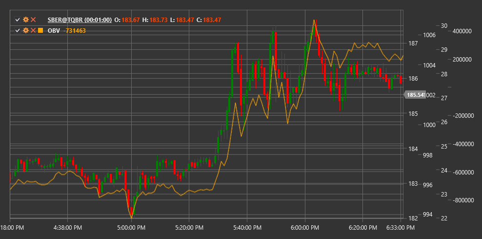

# OBV

**On-Balance Volume (OBV)** - это технический индикатор, разработанный Джозефом Гранвиллем, который использует объем торгов для прогнозирования изменений цены путем накопления объема в зависимости от направления изменения цены.

Для использования индикатора необходимо использовать класс [OnBalanceVolume](xref:StockSharp.Algo.Indicators.OnBalanceVolume).

## Описание

On-Balance Volume (OBV) - это кумулятивный индикатор, который добавляет объем к текущему значению, когда цена закрытия растет, и вычитает объем, когда цена закрытия падает. Индикатор основан на концепции, что изменения в объеме предшествуют изменениям в цене. Согласно этой теории, когда объем значительно растет без соответствующего изменения цены, следует ожидать, что цена в конечном итоге повысится, и наоборот.

OBV стремится обнаружить моменты, когда "умные деньги" (крупные институциональные инвесторы) накапливают или распределяют позиции, что может предвещать будущее движение цены. Индикатор особенно полезен для выявления дивергенций между ценой и объемом, которые могут сигнализировать о потенциальных разворотах на рынке.

Индикатор OBV был впервые представлен Джозефом Гранвиллем в 1963 году в его книге "Granville's New Key to Stock Market Profits" и с тех пор стал одним из наиболее широко используемых индикаторов объема.

## Расчет

Расчет On-Balance Volume очень прост:

1. Установка начального значения OBV (обычно 0 или произвольное число):
   ```
   OBV[начальное] = 0
   ```

2. Для каждого последующего периода:
   ```
   Если Close[текущий] > Close[предыдущий], то:
       OBV[текущий] = OBV[предыдущий] + Volume[текущий]
   Если Close[текущий] < Close[предыдущий], то:
       OBV[текущий] = OBV[предыдущий] - Volume[текущий]
   Если Close[текущий] = Close[предыдущий], то:
       OBV[текущий] = OBV[предыдущий]
   ```

где:
- Close - цена закрытия
- Volume - объем торгов

## Интерпретация

On-Balance Volume можно интерпретировать следующим образом:

1. **Трендовый анализ**:
   - Растущий OBV указывает на то, что объем вливается в рынок (накопление), что может предвещать рост цены
   - Падающий OBV указывает на то, что объем покидает рынок (распределение), что может предвещать падение цены
   - Плоский OBV указывает на отсутствие направленного движения объема, что может соответствовать боковому тренду

2. **Подтверждение ценового тренда**:
   - Если OBV движется в том же направлении, что и цена, это подтверждает текущий ценовой тренд
   - Если OBV и цена движутся в противоположных направлениях, это может сигнализировать о потенциальном развороте тренда

3. **Дивергенции**:
   - Бычья дивергенция: цена формирует новый минимум, а OBV - более высокий минимум (сигнал к покупке)
   - Медвежья дивергенция: цена формирует новый максимум, а OBV - более низкий максимум (сигнал к продаже)

4. **Пробои OBV**:
   - Пробой OBV уровня сопротивления или поддержки часто предшествует подобному пробою на ценовом графике
   - Трейдеры могут использовать пробои линий тренда OBV для прогнозирования будущих движений цены

5. **Базовые линии**:
   - Некоторые трейдеры используют скользящие средние OBV в качестве "базовых линий"
   - Пересечение OBV с его скользящей средней может генерировать торговые сигналы

6. **Паттерны технического анализа**:
   - На графике OBV могут формироваться классические паттерны технического анализа, такие как "голова и плечи", "двойное дно" и т.д.
   - Эти паттерны могут предоставлять дополнительные торговые сигналы

7. **Объемные толчки**:
   - Внезапные резкие изменения в OBV могут указывать на значительное изменение в рыночных настроениях
   - Такие "объемные толчки" часто предшествуют существенным ценовым движениям

Важно отметить, что OBV - это кумулятивный индикатор, поэтому его абсолютное значение не имеет большого значения. Важны направление движения OBV и его отношение к ценовому движению.



## См. также

[ADL](accumulation_distribution_line.md)
[ChaikinMoneyFlow](chaikin_money_flow.md)
[ForceIndex](force_index.md)
[NegativeVolumeIndex](negative_volume_index.md)