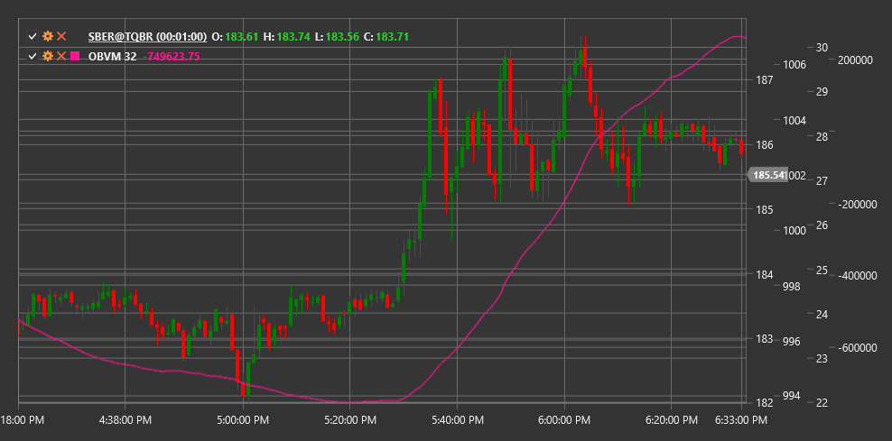

# OBVM

**Среднее значение объема баланса (On Balance Volume Mean, OBVM)** - это технический индикатор, который представляет собой скользящее среднее от индикатора On Balance Volume (OBV), позволяющее выявить более четкие сигналы тренда на основе объема.

Для использования индикатора необходимо использовать класс [OnBalanceVolumeMean](xref:StockSharp.Algo.Indicators.OnBalanceVolumeMean).

## Описание

Среднее значение объема баланса (OBVM) - это модификация классического индикатора On Balance Volume (OBV), который применяет скользящее среднее к значениям OBV для сглаживания колебаний и выявления более четких трендов. Индикатор сохраняет основную концепцию OBV - накопление объема в зависимости от направления изменения цены, но добавляет дополнительный уровень фильтрации.

OBVM помогает устранить шум, присутствующий в исходном OBV, и делает более заметными долгосрочные тенденции в объемных потоках. Это особенно полезно на волатильных рынках или при анализе инструментов с нерегулярными объемами торгов.

Основное преимущество OBVM заключается в его способности генерировать более четкие и менее подверженные ложным сигналам торговые сигналы по сравнению с классическим OBV. Индикатор также может использоваться для выявления пересечений между OBV и его средним значением, что предоставляет дополнительные торговые возможности.

## Параметры

Индикатор имеет следующие параметры:
- **Length** - период для расчета скользящего среднего (стандартное значение: 20)

## Расчет

Расчет Среднего значения объема баланса включает следующие этапы:

1. Расчет базового индикатора On Balance Volume (OBV):
   ```
   Если Close[текущий] > Close[предыдущий]:
       OBV[текущий] = OBV[предыдущий] + Volume[текущий]
   Если Close[текущий] < Close[предыдущий]:
       OBV[текущий] = OBV[предыдущий] - Volume[текущий]
   Если Close[текущий] = Close[предыдущий]:
       OBV[текущий] = OBV[предыдущий]
   ```

2. Применение скользящего среднего к значениям OBV:
   ```
   OBVM = SMA(OBV, Length)
   ```

где:
- Close - цена закрытия
- Volume - объем торгов
- OBV - On Balance Volume
- SMA - простое скользящее среднее
- Length - период скользящего среднего

Примечание: Вместо SMA могут использоваться и другие типы скользящих средних, такие как EMA (экспоненциальное скользящее среднее), WMA (взвешенное скользящее среднее) и т.д.

## Интерпретация

Среднее значение объема баланса можно интерпретировать следующим образом:

1. **Трендовый анализ**:
   - Растущий OBVM указывает на бычий тренд с сильной поддержкой объема
   - Падающий OBVM указывает на медвежий тренд с сильной поддержкой объема
   - Плоский OBVM указывает на отсутствие выраженного тренда

2. **Пересечения OBV и OBVM**:
   - Когда OBV пересекает OBVM снизу вверх, это может рассматриваться как бычий сигнал
   - Когда OBV пересекает OBVM сверху вниз, это может рассматриваться как медвежий сигнал
   - Эти пересечения часто указывают на начало новых трендов или значительных движений цены

3. **Дивергенции**:
   - Бычья дивергенция: цена формирует новый минимум, а OBVM - более высокий минимум
   - Медвежья дивергенция: цена формирует новый максимум, а OBVM - более низкий максимум
   - Дивергенции часто предшествуют значительным разворотам тренда

4. **Подтверждение ценового тренда**:
   - Если OBVM движется в том же направлении, что и цена, это подтверждает текущий ценовой тренд
   - Если OBVM и цена движутся в противоположных направлениях, это может сигнализировать о потенциальном развороте тренда

5. **Уровни поддержки и сопротивления**:
   - График OBVM может формировать собственные уровни поддержки и сопротивления
   - Пробой этих уровней может предшествовать подобным пробоям на ценовом графике

6. **Сравнение с другими объемными индикаторами**:
   - OBVM можно сравнивать с другими объемными индикаторами для подтверждения сигналов
   - Согласованность сигналов от нескольких объемных индикаторов повышает их надежность

7. **Выбор параметра Length**:
   - Более короткие периоды (например, 10-15) делают OBVM более чувствительным к краткосрочным изменениям
   - Более длинные периоды (например, 30-50) лучше выявляют долгосрочные тренды
   - Оптимальный период зависит от временного горизонта торговли и характеристик конкретного инструмента



## См. также

[OBV](obv.md)
[ADL](accumulation_distribution_line.md)
[ChaikinMoneyFlow](chaikin_money_flow.md)
[ForceIndex](force_index.md)