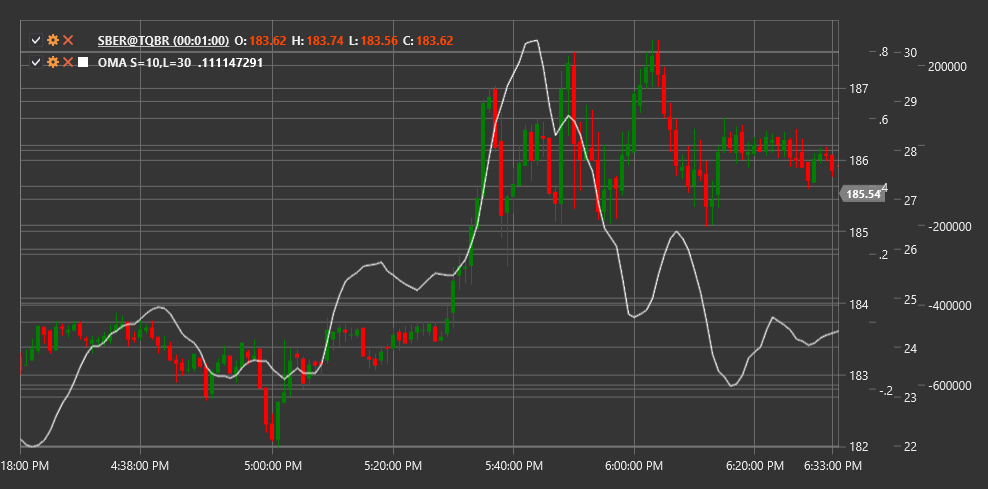

# OMA

**Осциллятор скользящей средней (Oscillator of Moving Average, OMA)** - это технический индикатор, который измеряет разницу между двумя скользящими средними с разными периодами для определения импульса и потенциальных точек разворота.

Для использования индикатора необходимо использовать класс [OscillatorOfMovingAverage](xref:StockSharp.Algo.Indicators.OscillatorOfMovingAverage).

## Описание

Осциллятор скользящей средней (OMA) представляет собой разницу между короткой и длинной скользящими средними. Этот индикатор помогает определить силу тренда и его потенциальные изменения, анализируя взаимоотношение между скользящими средними разных периодов.

OMA работает по принципу, схожему с MACD (Moving Average Convergence Divergence), но в более простой форме, так как он не включает сигнальную линию. Индикатор осциллирует вокруг нулевой линии, где положительные значения указывают на то, что короткая скользящая средняя находится выше длинной (бычье состояние), а отрицательные значения - на то, что короткая скользящая средняя находится ниже длинной (медвежье состояние).

Основная сила OMA заключается в его способности выявлять изменения в импульсе тренда и генерировать торговые сигналы на основе пересечений нулевой линии и дивергенций с ценой.

## Параметры

Индикатор имеет следующие параметры:
- **ShortPeriod** - период для короткой скользящей средней (стандартное значение: 12)
- **LongPeriod** - период для длинной скользящей средней (стандартное значение: 26)

## Расчет

Расчет Осциллятора скользящей средней включает следующие этапы:

1. Расчет короткой скользящей средней:
   ```
   Short MA = SMA(Price, ShortPeriod)
   ```

2. Расчет длинной скользящей средней:
   ```
   Long MA = SMA(Price, LongPeriod)
   ```

3. Расчет OMA как разницы между короткой и длинной скользящими средними:
   ```
   OMA = Short MA - Long MA
   ```

где:
- Price - цена (обычно цена закрытия)
- SMA - простое скользящее среднее
- ShortPeriod - период для короткой скользящей средней
- LongPeriod - период для длинной скользящей средней

Примечание: Вместо SMA могут использоваться и другие типы скользящих средних, такие как EMA (экспоненциальное скользящее среднее), WMA (взвешенное скользящее среднее) и т.д.

## Интерпретация

Осциллятор скользящей средней можно интерпретировать следующим образом:

1. **Пересечение нулевой линии**:
   - Пересечение OMA нулевой линии снизу вверх (короткая MA пересекает длинную MA снизу вверх) может рассматриваться как бычий сигнал
   - Пересечение OMA нулевой линии сверху вниз (короткая MA пересекает длинную MA сверху вниз) может рассматриваться как медвежий сигнал

2. **Экстремальные значения**:
   - Высокие положительные значения OMA указывают на то, что рынок может быть перекуплен
   - Высокие отрицательные значения OMA указывают на то, что рынок может быть перепродан
   - Экстремальные значения часто предшествуют коррекциям или разворотам тренда

3. **Дивергенции**:
   - Бычья дивергенция: цена формирует новый минимум, а OMA - более высокий минимум
   - Медвежья дивергенция: цена формирует новый максимум, а OMA - более низкий максимум
   - Дивергенции часто предшествуют значительным разворотам тренда

4. **Подтверждение тренда**:
   - Положительные значения OMA подтверждают восходящий тренд
   - Отрицательные значения OMA подтверждают нисходящий тренд
   - Увеличение абсолютного значения OMA указывает на усиление текущего тренда

5. **Центральная линия (0)**:
   - Когда OMA колеблется вокруг нулевой линии, это может указывать на отсутствие выраженного тренда или консолидацию

6. **Скорость изменения**:
   - Наклон OMA указывает на скорость изменения тренда
   - Крутой наклон указывает на быстрое изменение тренда
   - Пологий наклон указывает на медленное изменение тренда

7. **Комбинирование с другими индикаторами**:
   - OMA часто используется в сочетании с другими индикаторами для подтверждения сигналов
   - Особенно эффективно сочетание с индикаторами перекупленности/перепроданности, такими как RSI или Stochastic



## См. также

[MACD](macd.md)
[MovingAverageCrossover](moving_average_crossover.md)
[SMA](sma.md)
[EMA](ema.md)