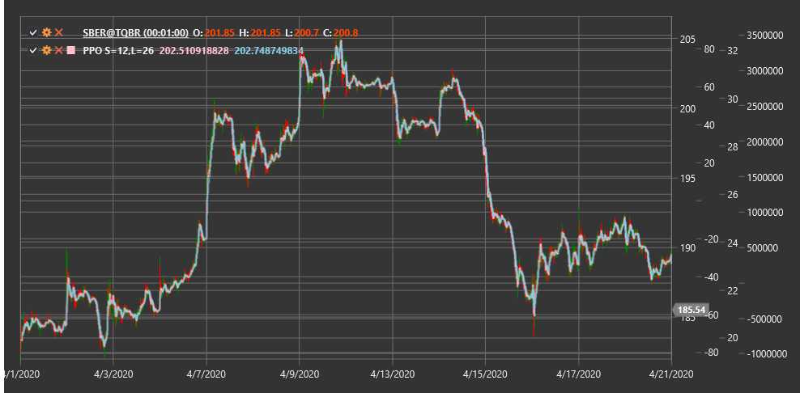

# PPO

**Осциллятор процентной цены (Percentage Price Oscillator, PPO)** - это технический индикатор, похожий на MACD, но выражающий разницу между двумя экспоненциальными скользящими средними в процентном отношении, а не в абсолютных значениях.

Для использования индикатора необходимо использовать класс [PercentagePriceOscillator](xref:StockSharp.Algo.Indicators.PercentagePriceOscillator).

## Описание

Осциллятор процентной цены (PPO) является вариацией более известного индикатора MACD (Moving Average Convergence Divergence). Основное отличие заключается в том, что PPO выражает разницу между двумя экспоненциальными скользящими средними в виде процента, а не в абсолютных единицах. Это делает PPO особенно полезным при сравнении разных инструментов с различными ценовыми уровнями или при анализе одного инструмента за длительный период времени, когда его цена значительно изменилась.

PPO состоит из трех компонентов:
1. **Линия PPO** - разница между быстрой и медленной EMA, выраженная в процентах
2. **Сигнальная линия** - EMA от линии PPO
3. **Гистограмма** - разница между линией PPO и сигнальной линией

Индикатор PPO колеблется вокруг нулевой линии, где положительные значения указывают на бычье настроение рынка, а отрицательные - на медвежье. Величина отклонения от нуля отражает силу текущего тренда.

## Параметры

Индикатор имеет следующие параметры:
- **ShortPeriod** - период для расчета короткой EMA (стандартное значение: 12)
- **LongPeriod** - период для расчета длинной EMA (стандартное значение: 26)

## Расчет

Расчет Осциллятора процентной цены включает следующие этапы:

1. Расчет короткой и длинной экспоненциальных скользящих средних:
   ```
   Short EMA = EMA(Price, ShortPeriod)
   Long EMA = EMA(Price, LongPeriod)
   ```

2. Расчет линии PPO как процентной разницы между короткой и длинной EMA:
   ```
   PPO Line = ((Short EMA - Long EMA) / Long EMA) * 100
   ```

3. Расчет сигнальной линии (обычно 9-периодная EMA от линии PPO):
   ```
   Signal Line = EMA(PPO Line, 9)
   ```

4. Расчет гистограммы:
   ```
   Histogram = PPO Line - Signal Line
   ```

где:
- Price - цена (обычно цена закрытия)
- EMA - экспоненциальное скользящее среднее
- ShortPeriod - период для короткой EMA
- LongPeriod - период для длинной EMA

## Интерпретация

Осциллятор процентной цены можно интерпретировать следующим образом:

1. **Пересечение нулевой линии**:
   - Пересечение линией PPO нулевой линии снизу вверх может рассматриваться как бычий сигнал
   - Пересечение линией PPO нулевой линии сверху вниз может рассматриваться как медвежий сигнал

2. **Пересечение сигнальной линии**:
   - Пересечение линией PPO сигнальной линии снизу вверх может рассматриваться как бычий сигнал
   - Пересечение линией PPO сигнальной линии сверху вниз может рассматриваться как медвежий сигнал

3. **Дивергенции**:
   - Бычья дивергенция: цена формирует новый минимум, а PPO - более высокий минимум
   - Медвежья дивергенция: цена формирует новый максимум, а PPO - более низкий максимум

4. **Перекупленность/перепроданность**:
   - Экстремально высокие положительные значения PPO могут указывать на перекупленность рынка
   - Экстремально низкие отрицательные значения PPO могут указывать на перепроданность рынка

5. **Анализ гистограммы**:
   - Расширение гистограммы указывает на усиление текущего тренда
   - Сужение гистограммы указывает на ослабление текущего тренда
   - Изменение цвета (или знака) гистограммы указывает на смену краткосрочного импульса

6. **Сравнение инструментов**:
   - В отличие от MACD, PPO можно использовать для прямого сравнения разных инструментов
   - Более высокие значения PPO для одного инструмента по сравнению с другим могут указывать на более сильный относительный импульс

7. **Фильтрация сигналов**:
   - Сигналы пересечения сигнальной линии более надежны, когда PPO находится в соответствии с основным трендом
   - Например, бычьи сигналы более надежны, когда PPO положительный, и медвежьи сигналы более надежны, когда PPO отрицательный



## См. также

[MACD](macd.md)
[EMA](ema.md)
[Percentage Price Oscillator Signal](percentage_price_oscillator_signal.md)
[Percentage Price Oscillator Histogram](percentage_price_oscillator_histogram.md)
[PercentageVolumeOscillator](percentage_volume_oscillator.md)
[TRIX](trix.md)
