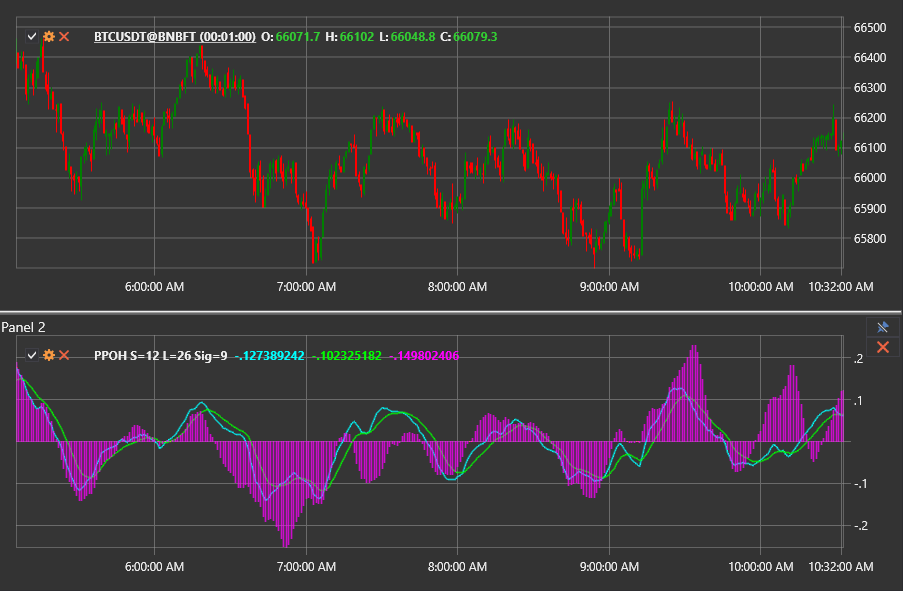

# PPOH

**Percentage Price Oscillator Histogram (PPOH)** отображает разницу между линией PPO и её сигнальной линией в виде гистограммы, что позволяет быстро оценить баланс импульса.

Для использования индикатора необходимо применить класс [PercentagePriceOscillatorHistogram](xref:StockSharp.Algo.Indicators.PercentagePriceOscillatorHistogram).

## Описание

Гистограмма PPO является производной от стандартного осциллятора процентной цены. Вместо показа двух линий (PPO и сигнальной) индикатор визуализирует их разницу в виде столбиков вокруг нулевого уровня. Положительные столбики означают, что линия PPO находится выше сигнальной (бычий импульс), отрицательные — ниже (медвежий импульс).

Гистограмма чувствительно реагирует на изменения дистанции между линиями PPO и сигнала, что делает её удобной для раннего распознавания изменения силы тренда и поиска дивергенций.

## Расчёт

1. Рассчитайте линию PPO и её сигнальную линию с выбранными периодами.
2. Вычтите сигнальную линию из линии PPO, чтобы получить значение гистограммы.

```
Histogram = PPO - Signal
```

Значения выше нуля указывают на преобладание бычьего давления, ниже — медвежьего. Скорость расширения или сжатия столбиков подсказывает ускорение или замедление импульса.

## Интерпретация

- **Пересечения нулевой линии.** Переход гистограммы выше нуля подтверждает, что линия PPO пересекла сигнальную линию снизу вверх (бычий сигнал). Падение ниже нуля указывает на медвежье пересечение.
- **Импульсные всплески.** Быстро растущие положительные столбики свидетельствуют об усилении бычьего импульса; сокращение столбиков может сигнализировать о скором развороте.
- **Дивергенции.** Расхождение между движением цены и гистограммой заранее предупреждает о возможной потере трендовой силы.



## См. также

- [Percentage Price Oscillator](percentage_price_oscillator.md)
- [Percentage Price Oscillator Signal](percentage_price_oscillator_signal.md)
