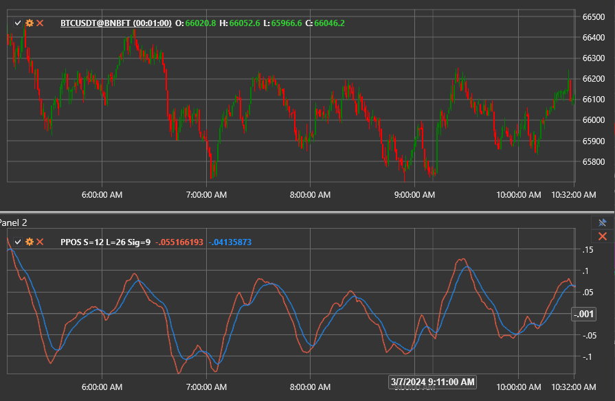

# PPOS

**Percentage Price Oscillator Signal (PPOS)** — модификация стандартного осциллятора процентной цены (PPO), в которой особое внимание уделяется сигнальной линии для фильтрации торговых сигналов.

Для использования индикатора необходимо применить класс [PercentagePriceOscillatorSignal](xref:StockSharp.Algo.Indicators.PercentagePriceOscillatorSignal).

## Описание

Осциллятор процентной цены измеряет процентную разницу между двумя экспоненциальными скользящими средними (EMA). Версия с сигнальной линией сглаживает линию PPO дополнительной EMA, помогая трейдерам реагировать только на более устойчивые изменения импульса.

Индикатор состоит из следующих компонентов:

1. **Линия PPO** — процентная разница между быстрой и медленной EMA.
2. **Сигнальная линия** — EMA от линии PPO (по умолчанию период 9).

Когда линия PPO пересекает сигнальную линию снизу вверх, это указывает на усиление бычьего импульса; пересечение сверху вниз сигнализирует об усилении медвежьего импульса. Нахождение линии PPO выше или ниже сигнальной линии подтверждает силу текущего тренда.

## Расчёт

1. Рассчитайте быструю и медленную EMA выбранного ряда цен.
2. Вычислите линию PPO как процентную дистанцию между быстрой и медленной EMA.
3. Сгладьте линию PPO с помощью EMA, чтобы получить сигнальную линию.

```
FastEMA = EMA(Price, ShortPeriod)
SlowEMA = EMA(Price, LongPeriod)
PPO = ((FastEMA - SlowEMA) / SlowEMA) * 100
Signal = EMA(PPO, SignalPeriod)
```

## Интерпретация

- **Пересечения сигнальной линии.** Бычий сигнал возникает при пересечении линией PPO сигнальной линии снизу вверх; противоположное пересечение указывает на медвежий импульс.
- **Подтверждение тренда.** Нахождение линии PPO выше сигнальной линии подтверждает восходящий тренд, ниже — нисходящий.
- **Дивергенции.** Расхождение между ценой и линией PPO вблизи сигнальной линии может заранее предупредить о скором развороте.



## См. также

- [Percentage Price Oscillator](percentage_price_oscillator.md)
- [Percentage Price Oscillator Histogram](percentage_price_oscillator_histogram.md)
