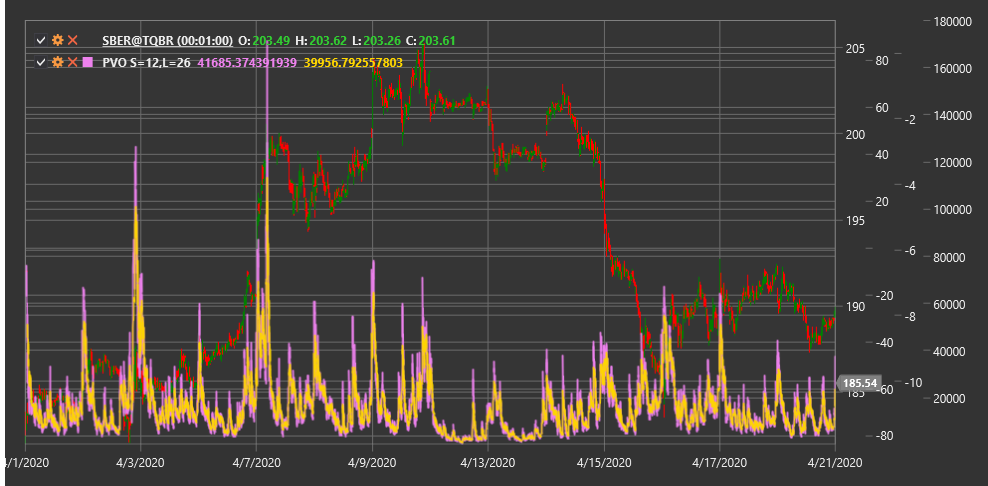

# PVO

**Осциллятор процентного объема (Percentage Volume Oscillator, PVO)** - это технический индикатор, аналогичный MACD, но применяемый к объему торгов вместо цены, и выражающий разницу между быстрой и медленной экспоненциальными скользящими средними объема в процентном отношении.

Для использования индикатора необходимо использовать класс [PercentageVolumeOscillator](xref:StockSharp.Algo.Indicators.PercentageVolumeOscillator).

## Описание

Осциллятор процентного объема (PVO) является модификацией индикатора MACD (Moving Average Convergence Divergence), применяемого к объему торгов вместо цены. Подобно PPO (Percentage Price Oscillator), PVO выражает разницу между быстрой и медленной экспоненциальными скользящими средними в виде процента, а не в абсолютных единицах. Это делает PVO особенно полезным при сравнении разных инструментов с различными уровнями объема торгов или при анализе одного инструмента за длительный период времени.

PVO состоит из трех компонентов:
1. **Линия PVO** - процентная разница между быстрой и медленной EMA объема
2. **Сигнальная линия** - EMA от линии PVO
3. **Гистограмма** - разница между линией PVO и сигнальной линией

Индикатор PVO помогает выявить аномалии в объеме торгов, которые могут предшествовать значительным движениям цены. Он также полезен для подтверждения ценовых трендов и выявления потенциальных точек разворота.

## Параметры

Индикатор имеет следующие параметры:
- **ShortPeriod** - период для расчета короткой EMA объема (стандартное значение: 12)
- **LongPeriod** - период для расчета длинной EMA объема (стандартное значение: 26)

## Расчет

Расчет Осциллятора процентного объема включает следующие этапы:

1. Расчет короткой и длинной экспоненциальных скользящих средних объема:
   ```
   Short EMA = EMA(Volume, ShortPeriod)
   Long EMA = EMA(Volume, LongPeriod)
   ```

2. Расчет линии PVO как процентной разницы между короткой и длинной EMA:
   ```
   PVO Line = ((Short EMA - Long EMA) / Long EMA) * 100
   ```

3. Расчет сигнальной линии (обычно 9-периодная EMA от линии PVO):
   ```
   Signal Line = EMA(PVO Line, 9)
   ```

4. Расчет гистограммы:
   ```
   Histogram = PVO Line - Signal Line
   ```

где:
- Volume - объем торгов
- EMA - экспоненциальное скользящее среднее
- ShortPeriod - период для короткой EMA
- LongPeriod - период для длинной EMA

## Интерпретация

Осциллятор процентного объема можно интерпретировать следующим образом:

1. **Пересечение нулевой линии**:
   - Пересечение линией PVO нулевой линии снизу вверх указывает на ускорение объема выше среднего, что может предвещать бычье движение
   - Пересечение линией PVO нулевой линии сверху вниз указывает на замедление объема ниже среднего, что может предвещать медвежье движение

2. **Пересечение сигнальной линии**:
   - Пересечение линией PVO сигнальной линии снизу вверх может рассматриваться как бычий сигнал
   - Пересечение линией PVO сигнальной линии сверху вниз может рассматриваться как медвежий сигнал

3. **Дивергенции**:
   - Бычья дивергенция: цена формирует новый минимум, а PVO - более высокий минимум
   - Медвежья дивергенция: цена формирует новый максимум, а PVO - более низкий максимум

4. **Экстремальные значения**:
   - Очень высокие значения PVO могут указывать на избыточный объем, что часто происходит во время пиков или паники на рынке
   - Очень низкие значения PVO могут указывать на недостаточный объем, что часто происходит во время затишья на рынке

5. **Анализ гистограммы**:
   - Увеличение положительной гистограммы указывает на усиление бычьего импульса в объеме
   - Увеличение отрицательной гистограммы указывает на усиление медвежьего импульса в объеме
   - Сужение гистограммы указывает на ослабление текущего импульса в объеме

6. **Подтверждение ценового тренда**:
   - Растущий PVO подтверждает восходящий ценовой тренд
   - Падающий PVO подтверждает нисходящий ценовой тренд
   - Расхождение между направлением PVO и ценой может сигнализировать о потенциальном развороте

7. **Объемные всплески**:
   - Резкие скачки PVO указывают на значительные изменения в объеме, которые часто сопровождают важные рыночные события
   - Такие всплески могут предшествовать или сопровождать прорывы ключевых уровней цены



## См. также

[PPO](percentage_price_oscillator.md)
[OBV](on_balance_volume.md)
[MACD](macd.md)
[ChaikinMoneyFlow](chaikin_money_flow.md)