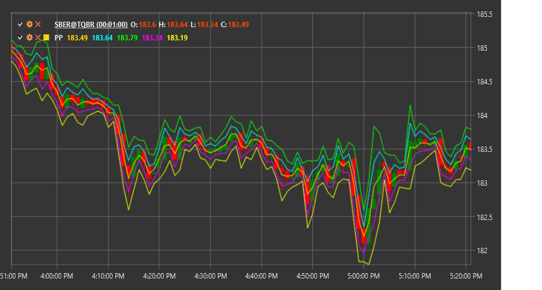

# PP

**Pivot Points (PP)** - это технический индикатор, который использует предыдущие максимальные, минимальные и закрывающие цены для определения потенциальных уровней поддержки и сопротивления на текущий торговый период.

Для использования индикатора необходимо использовать класс [PivotPoints](xref:StockSharp.Algo.Indicators.PivotPoints).

## Описание

Pivot Points (точки разворота) - это один из старейших и наиболее широко используемых методов определения ключевых уровней на рынке. Индикатор рассчитывает центральную точку разворота (PP) и несколько уровней поддержки (S1, S2, S3) и сопротивления (R1, R2, R3) на основе данных предыдущего периода.

Изначально Pivot Points использовались трейдерами на биржевых площадках для определения ключевых уровней на текущий торговый день на основе данных предыдущего дня. Сегодня этот метод адаптирован для различных временных рамок - от внутридневных до месячных.

Основная идея Pivot Points заключается в том, что рынок имеет тенденцию реагировать на эти предрассчитанные уровни, используя их как точки разворота или зоны, где может происходить консолидация. Трейдеры используют эти уровни для принятия решений о входе и выходе из рынка, а также для установки целевых уровней и стоп-лоссов.

## Расчет

Существует несколько методов расчета Pivot Points, включая стандартный, Фибоначчи, Вуди, Кэмарилла и DeMark. Ниже приведен стандартный метод расчета:

1. Расчет основной точки разворота (PP):
   ```
   PP = (High + Low + Close) / 3
   ```

2. Расчет первого уровня сопротивления (R1) и поддержки (S1):
   ```
   R1 = (2 * PP) - Low
   S1 = (2 * PP) - High
   ```

3. Расчет второго уровня сопротивления (R2) и поддержки (S2):
   ```
   R2 = PP + (High - Low)
   S2 = PP - (High - Low)
   ```

4. Расчет третьего уровня сопротивления (R3) и поддержки (S3):
   ```
   R3 = High + 2 * (PP - Low)
   S3 = Low - 2 * (High - PP)
   ```

где:
- High - максимальная цена предыдущего периода
- Low - минимальная цена предыдущего периода
- Close - цена закрытия предыдущего периода

## Интерпретация

Pivot Points можно интерпретировать следующим образом:

1. **Основная точка разворота (PP)**:
   - PP служит основным ориентиром для определения общего настроения рынка
   - Если цена находится выше PP, это указывает на бычье настроение
   - Если цена находится ниже PP, это указывает на медвежье настроение
   - PP также может служить уровнем поддержки или сопротивления

2. **Уровни сопротивления (R1, R2, R3)**:
   - Эти уровни представляют потенциальные зоны сопротивления в бычьем рынке
   - Пробой уровня может привести к продолжению движения до следующего уровня
   - Отскок от уровня может привести к развороту вниз

3. **Уровни поддержки (S1, S2, S3)**:
   - Эти уровни представляют потенциальные зоны поддержки в медвежьем рынке
   - Пробой уровня может привести к продолжению движения до следующего уровня
   - Отскок от уровня может привести к развороту вверх

4. **Торговые стратегии**:
   - **Отскок от уровней**: Вход в позицию при отскоке от уровня поддержки или сопротивления
   - **Пробой уровней**: Вход в позицию после подтвержденного пробоя уровня
   - **Диапазонная торговля**: Покупка у уровней поддержки и продажа у уровней сопротивления
   - **Установка целей**: Использование следующего уровня как целевого для фиксации прибыли
   - **Установка стоп-лоссов**: Размещение стоп-лоссов за пределами соответствующих уровней

5. **Комбинирование с другими индикаторами**:
   - Pivot Points часто используются в сочетании с другими техническими индикаторами для подтверждения сигналов
   - Особенно эффективно сочетание с индикаторами импульса (RSI, Stochastic) и трендовыми индикаторами (MA, MACD)

6. **Временные рамки**:
   - Дневные Pivot Points рассчитываются на основе предыдущего торгового дня
   - Недельные Pivot Points рассчитываются на основе предыдущей недели
   - Месячные Pivot Points рассчитываются на основе предыдущего месяца
   - Выбор временной рамки зависит от стиля торговли и временного горизонта



## См. также

[FibonacciRetracement](fibonacci_retracement.md)