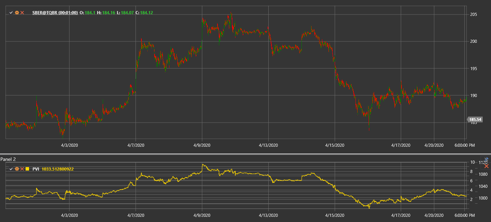

# PVI

**Индекс положительного объёма (Positive Volume Index, PVI)** - технический индикатор, разработанный Полом Дизартом, который фокусируется на изменениях цены в дни, когда объём торгов растёт по сравнению с предыдущим днём.

Для использования индикатора необходимо использовать класс [PositiveVolumeIndex](xref:StockSharp.Algo.Indicators.PositiveVolumeIndex).

## Описание

Индекс положительного объёма (PVI) основан на идее, что "толпа" (непрофессиональные трейдеры) более активна в дни с высоким объёмом, в то время как "умные деньги" действуют на низком объёме. PVI изменяется только в те дни, когда текущий объём выше объёма предыдущего дня.

Концепция индикатора предполагает, что движения цены на повышенном объёме отражают массовые настроения. PVI отслеживает эти движения, игнорируя ценовые изменения в дни с уменьшенным объёмом.

PVI часто используется вместе с дополнительным индикатором - Negative Volume Index (NVI), который, напротив, учитывает только те дни, когда объём уменьшается.

## Расчёт

Расчёт Индекса положительного объёма включает следующие этапы:

1. Установка начального значения PVI (обычно 1000):
   ```
   PVI[начальное] = 1000
   ```

2. Для каждого последующего периода:
   ```
   Если Volume[текущий] > Volume[предыдущий], то:
       PVI[текущий] = PVI[предыдущий] * (1 + (Price[текущий] - Price[предыдущий]) / Price[предыдущий])
   Иначе:
       PVI[текущий] = PVI[предыдущий]
   ```

где:
- Price - цена (обычно цена закрытия)
- Volume - объём торгов

Другими словами, PVI изменяется только в те дни, когда объём торгов растёт, и остаётся неизменным в дни со снижающимся или неизменным объёмом.

## Интерпретация

Индекс положительного объёма можно интерпретировать следующим образом:

1. **Трендовый анализ**:
   - Растущий PVI указывает на то, что "толпа" покупает, что может предвещать будущий рост цены
   - Падающий PVI указывает на то, что "толпа" продаёт, что может предвещать будущее падение цены

2. **Пересечение со скользящими средними**:
   - Часто PVI сравнивают с его 255-дневной скользящей средней (примерно один год торгов)
   - Когда PVI находится выше своей 255-дневной SMA, это считается бычьим сигналом
   - Когда PVI находится ниже своей 255-дневной SMA, это считается медвежьим сигналом

3. **Дивергенции**:
   - Бычья дивергенция: цена формирует новый минимум, а PVI - более высокий минимум
   - Медвежья дивергенция: цена формирует новый максимум, а PVI - более низкий максимум

4. **Комбинирование с NVI**:
   - Когда и PVI, и NVI растут, это сильный бычий сигнал
   - Когда и PVI, и NVI падают, это сильный медвежий сигнал
   - Когда PVI растёт, а NVI падает, это может указывать на то, что "толпа" покупает, а "умные деньги" продают (потенциально бычий сценарий)
   - Когда PVI падает, а NVI растёт, это может указывать на то, что "толпа" продаёт, а "умные деньги" покупают (потенциально медвежий сценарий)

5. **Долгосрочные изменения**:
   - PVI часто рассматривается как долгосрочный индикатор
   - Устойчивое изменение направления PVI может сигнализировать о значительном изменении рыночного настроения

6. **Подтверждение других индикаторов**:
   - PVI лучше всего использовать в сочетании с другими техническими индикаторами и методами анализа
   - Сигналы PVI становятся более надёжными, когда они подтверждаются другими индикаторами

7. **Установка порогов**:
   - Некоторые трейдеры устанавливают пороговые уровни для PVI (например, 5% выше или ниже скользящей средней)
   - Преодоление этих порогов может считаться более сильным сигналом, чем простое пересечение



## См. также

[OBV](on_balance_volume.md)
[ADL](accumulation_distribution_line.md)
[ChaikinMoneyFlow](chaikin_money_flow.md)
[ForceIndex](force_index.md)
[NegativeVolumeIndex](negative_volume_index.md)
