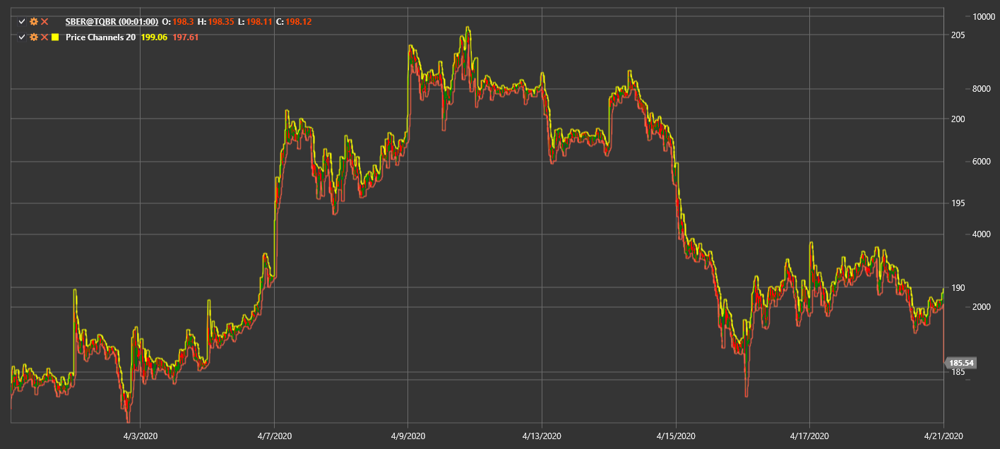

# Price Channels

**Ценовые каналы (Price Channels, PC)** показывают верхнюю и нижнюю границы движения цены за указанный период.

Для использования индикатора необходимо использовать класс [PriceChannels](xref:StockSharp.Algo.Indicators.PriceChannels).

## См. также

[Donchian Channels](donchian_channels.md)
