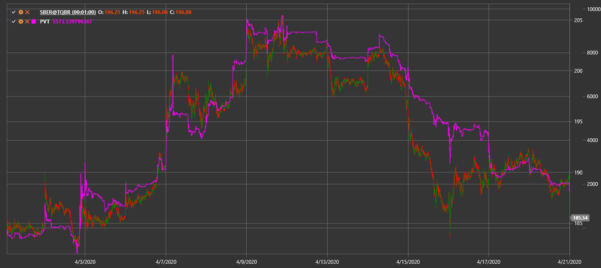

# PVT

**Price Volume Trend (PVT)** — накопительный индикатор, который умножает изменение цены на объём и показывает давление покупателей или продавцов.

Для использования индикатора необходимо использовать класс [PriceVolumeTrend](xref:StockSharp.Algo.Indicators.PriceVolumeTrend).

## См. также

[On-Balance Volume](on_balance_volume.md)
