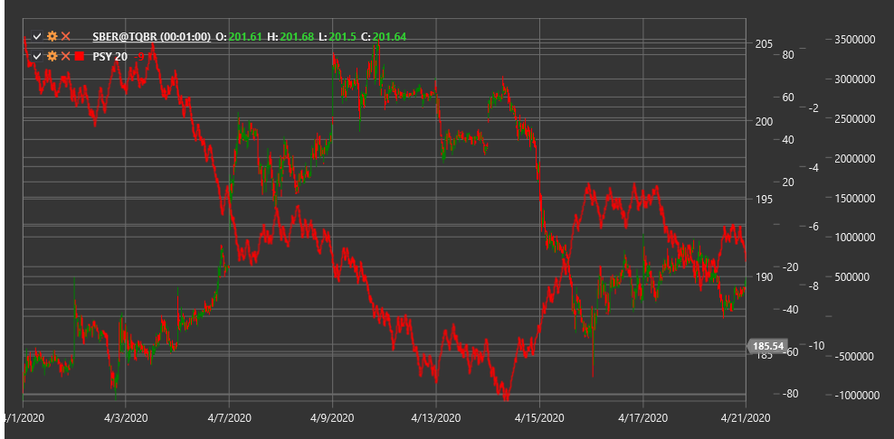

# PSY

**Психологическая линия (Psychological Line, PSY)** - это технический индикатор, который измеряет долю растущих периодов (свечей, баров) по отношению к общему количеству периодов за заданный промежуток времени.

Для использования индикатора необходимо использовать класс [PsychologicalLine](xref:StockSharp.Algo.Indicators.PsychologicalLine).

## Описание

Психологическая линия (PSY) - это простой, но эффективный индикатор, который отражает рыночное настроение, подсчитывая процентное соотношение периодов с ростом цены к общему количеству рассматриваемых периодов. Индикатор основан на предположении, что рыночная психология и настроения инвесторов играют важную роль в движении цен.

PSY является осциллятором, значения которого колеблются от 0 до 100, где:
- Значение 100 означает, что цена росла во всех рассматриваемых периодах
- Значение 0 означает, что цена падала во всех рассматриваемых периодах
- Значение 50 означает равное количество растущих и падающих периодов

Индикатор PSY помогает определить, находится ли рынок в состоянии перекупленности или перепроданности, а также может предсказывать потенциальные развороты тренда.

## Параметры

Индикатор имеет следующие параметры:
- **Length** - период расчета (стандартное значение: 12-14)

## Расчет

Расчет Психологической линии очень прост:

```
PSY = (Количество растущих периодов за Length периодов / Length) * 100
```

где:
- Растущий период определяется как период, где цена закрытия выше цены закрытия предыдущего периода
- Length - количество рассматриваемых периодов

## Интерпретация

Психологическую линию можно интерпретировать следующим образом:

1. **Уровни перекупленности и перепроданности**:
   - Значения выше 70-80 указывают на перекупленность рынка (слишком многие периоды были растущими)
   - Значения ниже 20-30 указывают на перепроданность рынка (слишком многие периоды были падающими)
   - Экстремальные значения часто предшествуют развороту тренда

2. **Средняя линия (50)**:
   - Пересечение уровня 50 снизу вверх может рассматриваться как бычий сигнал
   - Пересечение уровня 50 сверху вниз может рассматриваться как медвежий сигнал
   - Устойчивое движение выше 50 указывает на доминирование быков
   - Устойчивое движение ниже 50 указывает на доминирование медведей

3. **Дивергенции**:
   - Бычья дивергенция: цена формирует новый минимум, а PSY - более высокий минимум
   - Медвежья дивергенция: цена формирует новый максимум, а PSY - более низкий максимум

4. **Отскок от экстремальных уровней**:
   - Разворот PSY от зоны перекупленности может сигнализировать о потенциальном медвежьем развороте
   - Разворот PSY от зоны перепроданности может сигнализировать о потенциальном бычьем развороте

5. **Анализ тренда**:
   - В сильном восходящем тренде PSY часто остается выше 50, с периодическими отскоками от зоны перекупленности
   - В сильном нисходящем тренде PSY часто остается ниже 50, с периодическими отскоками от зоны перепроданности

6. **Настройка параметра Length**:
   - Более короткие периоды (например, 5-8) делают PSY более чувствительным и подходят для краткосрочной торговли
   - Более длинные периоды (например, 20-25) делают PSY более сглаженным и подходят для долгосрочной торговли

7. **Комбинирование с другими индикаторами**:
   - PSY часто используется в сочетании с другими индикаторами для подтверждения сигналов
   - Особенно полезно сочетание с трендовыми индикаторами и индикаторами объема



## См. также

[RSI](rsi.md)
[StochasticOscillator](stochastic_oscillator.md)
[UltimateOscillator](uo.md)
[MomentumOscillator](momentum.md)