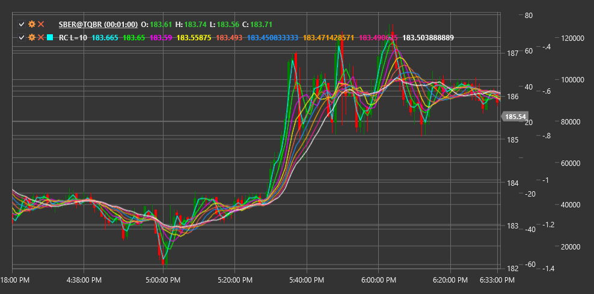

# RC

**Радужные графики (Rainbow Charts, RC)** - это индикатор технического анализа, который представляет собой набор скользящих средних с разными периодами, отображаемых на одном графике. Визуально индикатор напоминает радугу, отсюда и его название.

Для использования индикатора необходимо использовать класс [RainbowCharts](xref:StockSharp.Algo.Indicators.RainbowCharts).

## Описание

Радужные графики основаны на использовании нескольких скользящих средних (обычно простых SMA) с последовательно увеличивающимися периодами. Разные линии скользящих средних окрашиваются в разные цвета, создавая эффект радуги на графике.

Индикатор помогает определить направление и силу тренда:
- Когда линии расходятся, это указывает на усиление тренда
- Когда линии сходятся, это может сигнализировать о ослаблении тренда или возможном развороте
- Когда цена находится выше всех линий, это говорит о сильном восходящем тренде
- Когда цена находится ниже всех линий, это указывает на сильный нисходящий тренд

## Параметры

- **Lines** - количество используемых скользящих средних SMA в радужном графике.

## Расчет

Радужные графики состоят из нескольких скользящих средних (SMA), причем период каждой последующей линии увеличивается на определенный шаг. Для n линий с базовым периодом p, периоды рассчитываются как:

```
Period(i) = p + i * step
```

где:
- i - номер линии (от 0 до n-1)
- step - шаг увеличения периода (обычно 1)



## См. также

[SMA](sma.md)