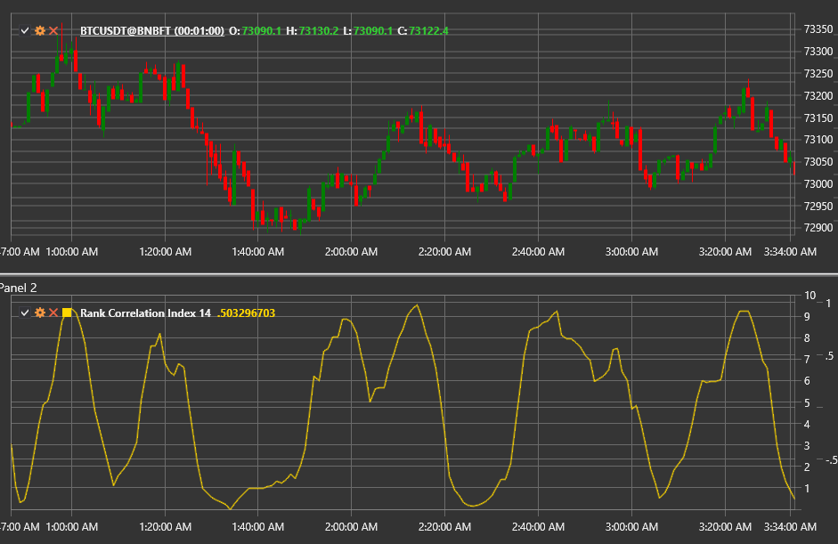

# Rank Correlation Index

**Rank Correlation Index (RCI)** — осциллятор, основанный на коэффициенте ранговой корреляции Спирмена. Индикатор сравнивает ранги
цен с рангами времени внутри окна и показывает, насколько текущий тренд согласуется с идеальным восходящим или нисходящим движением.

Для использования индикатора необходимо применять класс [RankCorrelationIndex](xref:StockSharp.Algo.Indicators.RankCorrelationIndex).

## Расчёт

1. Каждому значению цены в окне длины **Length** присваивается ранг (1 — самая старая цена, Length — самая свежая).
2. Рассчитывается ранг цен по величине (наименьшая цена получает ранг 1, наибольшая — ранг Length).
3. Для каждого бара вычисляется разница рангов `d = RankTime − RankPrice`.
4. Итоговое значение определяется формулой Спирмена:  
   `RCI = 1 − (6 × Σ d²) / (Length × (Length² − 1))`.

RCI принимает значения от −100 до +100 (при умножении результата на 100 для удобства отображения).

## Параметры

- **Length** — размер окна для расчёта.

## Интерпретация

- **RCI ≈ +100** — идеально возрастающая последовательность (сильный восходящий тренд).
- **RCI ≈ −100** — идеально убывающая последовательность (сильный нисходящий тренд).
- **RCI около 0** — хаотичное движение или боковой тренд.
- Дивергенции между ценой и RCI могут предвещать разворот.

Индикатор полезен для краткосрочного анализа тренда и обнаружения разворотных зон, особенно в сочетании с осцилляторами моментума.

## См. также

[Momentum](momentum.md)
[ROC](roc.md)
[RSI](rsi.md)
