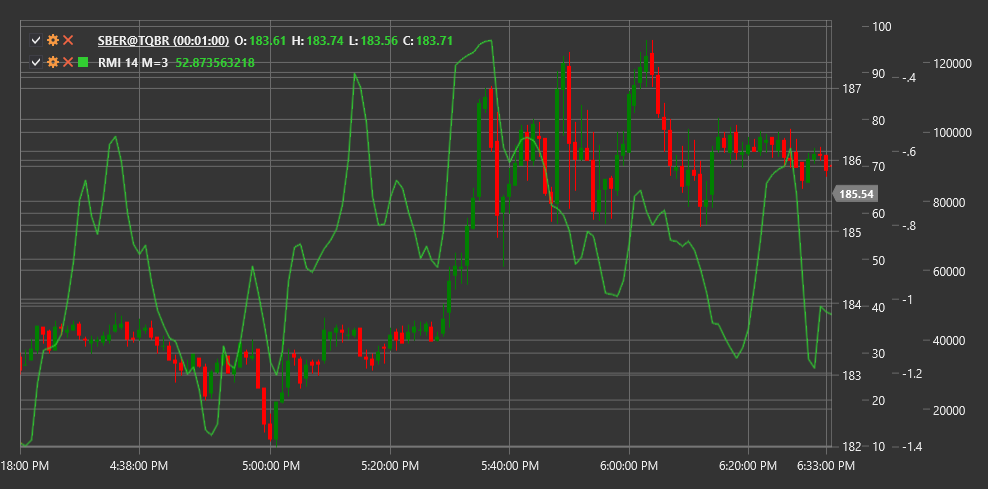

# RMI

**Индекс относительного импульса (Relative Momentum Index, RMI)** - это модификация традиционного индикатора RSI, предложенная Роджером Альтманом. В отличие от классического RSI, который рассчитывает соотношение между повышением и понижением цены за определенный период, RMI учитывает относительное изменение цены за выбранный период моментума.

Для использования индикатора необходимо использовать класс [RelativeMomentumIndex](xref:StockSharp.Algo.Indicators.RelativeMomentumIndex).

## Описание

Индекс относительного импульса (RMI) улучшает классический RSI, добавляя параметр периода моментума. Это позволяет трейдерам регулировать чувствительность индикатора, не меняя основной период расчета.

Как и RSI, RMI колеблется в диапазоне от 0 до 100:
- Значения выше 70 обычно указывают на перекупленность рынка
- Значения ниже 30 указывают на перепроданность
- Центральная линия 50 служит ориентиром для определения основного направления движения рынка

RMI особенно полезен для определения потенциальных точек разворота тренда, а также для подтверждения силы текущего тренда.

## Параметры

- **MomentumPeriod** - период моментума, определяющий временной лаг для сравнения цен.
- **Length** - основной период для расчета индикатора (аналогично периоду в RSI).

## Расчет

Расчет RMI выполняется в несколько этапов:

1. Рассчитать моментум как разницу между текущей ценой и ценой n периодов назад:
   ```
   Momentum = Price(current) - Price(current - MomentumPeriod)
   ```

2. Разделить моментумы на положительные (U) и отрицательные (D):
   ```
   Если Momentum > 0, то U = Momentum, D = 0
   Если Momentum < 0, то U = 0, D = |Momentum|
   ```

3. Рассчитать средние значения положительных и отрицательных моментумов за указанный период:
   ```
   AverageU = SMA(U, Length)
   AverageD = SMA(D, Length)
   ```

4. Рассчитать относительную силу:
   ```
   RS = AverageU / AverageD
   ```

5. Преобразовать в индекс относительного импульса:
   ```
   RMI = 100 - (100 / (1 + RS))
   ```



## См. также

[RSI](rsi.md)
[Momentum](momentum.md)