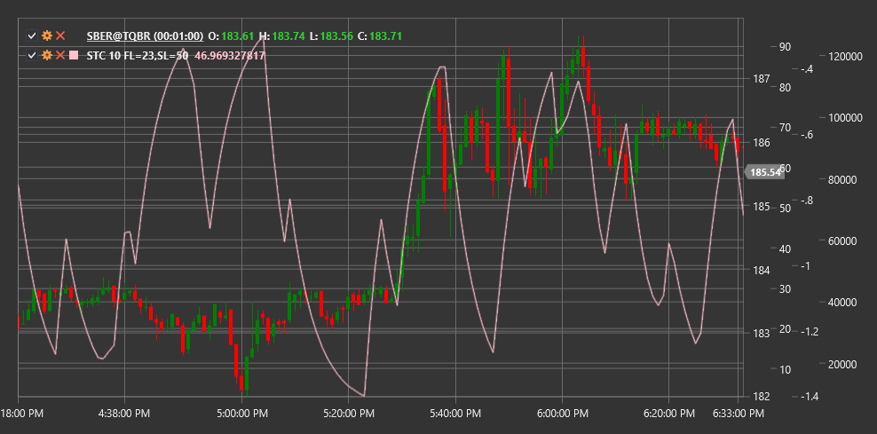

# STC

**Цикл тренда Шаффа (Schaff Trend Cycle, STC)** - это индикатор импульса, разработанный Дугом Шаффом. STC основан на предположении, что рыночные циклы чаще движутся между перекупленными и перепроданными условиями, чем в реальном тренде.

Для использования индикатора необходимо использовать класс [SchaffTrendCycle](xref:StockSharp.Algo.Indicators.SchaffTrendCycle).

## Описание

Цикл тренда Шаффа сочетает в себе преимущества стохастического осциллятора, MACD и циклического анализа. Этот индикатор может быстрее реагировать на изменения тренда, чем традиционные индикаторы, такие как MACD или стохастик.

STC колеблется в диапазоне от 0 до 100:
- Значения выше 75 обычно указывают на перекупленность
- Значения ниже 25 указывают на перепроданность
- Пересечение индикатором уровня 50 может сигнализировать о смене тренда

Основные сигналы индикатора:
- Покупка, когда STC пересекает уровень 25 снизу вверх (выход из зоны перепроданности)
- Продажа, когда STC пересекает уровень 75 сверху вниз (выход из зоны перекупленности)

## Параметры

- **Length** - основной период для расчета индикатора.

## Расчет

Расчет STC выполняется в несколько этапов:

1. Рассчитать MACD:
   ```
   MACD = EMA(Close, Fast) - EMA(Close, Slow)
   Signal = EMA(MACD, Signal)
   ```
   где Fast, Slow и Signal - обычно 23, 50 и 10 соответственно.

2. Вычислить стохастический осциллятор на основе MACD:
   ```
   Stoch_K = 100 * ((MACD - Lowest(MACD, Length)) / (Highest(MACD, Length) - Lowest(MACD, Length)))
   Stoch_D = EMA(Stoch_K, 3)
   ```

3. Повторить стохастический расчет для получения STC:
   ```
   STC = 100 * ((Stoch_D - Lowest(Stoch_D, Length)) / (Highest(Stoch_D, Length) - Lowest(Stoch_D, Length)))
   ```

В результате получается осциллятор, который более плавный, чем классический стохастик, и быстрее реагирует на изменения тренда, чем MACD.



## См. также

[MACD](macd.md)
[Стохастик](stochastic_oscillator.md)